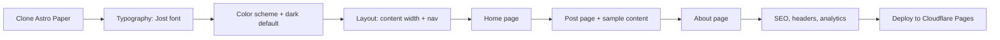

# Implementation Plan — Personal Blog Website

## Problem Statement
Build a minimal, dark-themed personal blogging website for essays and opinions, using Astro Paper v5.5.1 as the base theme, customized to match a typography-forward, distraction-free design. Deployed to Cloudflare Pages.

## Requirements
- Base: Astro Paper v5.5.1 (Tailwind 4, TypeScript, SEO, dark/light mode, tags, Pagefind search, RSS, sitemap, dynamic OG images built-in)
- Font: Jost (warm, rounded sans-serif) via `@fontsource/jost`
- Dark theme as default
- Single column, centered, ~650–700px content width
- Pages: Home (intro + recent posts), Blog post, About
- No Library page (future enhancement)
- No CMS — Markdown + Git workflow
- No contact form (future enhancement)
- Hosting: Cloudflare Pages with Cloudflare Registrar for domain
- Package manager: `pnpm` throughout (matches Astro Paper's lockfile)

## Design Decisions (locked before implementation)

| Decision | Value | Rationale |
|---|---|---|
| Accent color | `#60a5fa` (blue-400) | Clean, readable on dark bg, familiar link color. Alternatives: `#e5a158` (warm amber), `#f472b6` (pink) |
| Keep Pagefind search? | Yes — keep in nav as icon | Valuable for a growing blog, zero-JS at rest, built into build pipeline |
| Keep tags? | Yes — keep tag system, show on post list | Built-in, useful for organization, minimal overhead |
| Light mode palette | Defined below | Proper inverse, not hand-waved |
| Font approach | `@fontsource/jost` (stable, self-hosted) | Astro Paper uses experimental fonts API — too risky for production |
| Shiki code theme | `night-owl` (dark) / `min-light` (light) | Already configured, works well on near-black bg |

## Color Scheme

### Dark mode (default)
```
--background:       #0a0a0a   (near-black, design doc)
--foreground:       #e5e5e5   (soft white, design doc)
--accent:           #60a5fa   (blue-400, links/highlights)
--muted:            #171717   (card/scrollbar bg)
--border:           #262626   (subtle borders)
```
Metadata text (dates, reading time): `#a3a3a3` — applied via Tailwind class `text-[#a3a3a3]` or a `--muted-foreground` CSS variable.

### Light mode
```
--background:       #fafafa
--foreground:       #171717
--accent:           #2563eb   (blue-600, darker for light bg contrast)
--muted:            #f5f5f5
--border:           #e5e5e5
```

## Astro Paper v5.5.1 — Key Files Reference

Understanding the actual codebase before making changes:

```
src/
├── config.ts              # SITE object: title, author, desc, lightAndDarkMode, postPerIndex, etc.
├── constants.ts           # SOCIALS[] and SHARE_LINKS[] arrays
├── content.config.ts      # Content collection schema (blog posts)
├── scripts/
│   └── theme.ts           # initialColorScheme variable ("" | "light" | "dark"), theme toggle logic
├── styles/
│   ├── global.css         # CSS custom properties (--background, --foreground, --accent, --muted, --border),
│   │                      #   @theme inline block, @utility max-w-app (max-w-3xl = 768px), @utility app-layout
│   └── typography.css     # @tailwindcss/typography prose overrides, Shiki code block styles
├── layouts/
│   ├── Layout.astro       # <head>, meta tags, OG, structured data, imports global.css
│   ├── PostDetails.astro  # Post page: title, datetime, tags, content, share links, prev/next nav
│   └── AboutLayout.astro  # About page layout
├── components/
│   ├── Header.astro       # Nav: Posts, Tags, About, Archives, Search icon, Theme toggle
│   ├── Card.astro         # Post card used in lists
│   ├── Datetime.astro     # Date + reading time display
│   ├── Footer.astro       # Footer
│   ├── Tag.astro          # Tag pill
│   └── ...
├── pages/
│   ├── index.astro        # Home: hero "Mingalaba", socials, featured posts, recent posts
│   ├── about.md           # About page (uses AboutLayout)
│   └── ...
└── data/
    └── blog/              # Markdown blog posts live here
        └── *.md
```

```
astro.config.ts            # Site URL, sitemap, Shiki config, experimental fonts (Google Sans Code),
                           #   Tailwind vite plugin, remark plugins
package.json               # Build: "astro check && astro build && pagefind --site dist && cp -r dist/pagefind public/"
```

## Proposed Solution

Clone Astro Paper, then customize layer-by-layer. Each task produces a visible, demoable change.



---

## Task Breakdown

### Task 1: Project scaffolding and Jost font integration

**Objective:** Clone Astro Paper, install dependencies, replace Google Sans Code with Jost.

**Implementation:**
1. Scaffold the project:
   ```bash
   pnpm create astro@latest -- --template satnaing/astro-paper myblog
   cd myblog
   pnpm install
   ```
2. Install Jost via Fontsource:
   ```bash
   pnpm add @fontsource/jost
   ```
3. Remove the experimental fonts API from `astro.config.ts`:
   - Delete the entire `experimental.fonts` array (the Google Sans Code entry)
   - Keep `experimental.preserveScriptOrder: true`
4. Import Jost in `src/layouts/Layout.astro`:
   ```astro
   ---
   import '@fontsource/jost/400.css';
   import '@fontsource/jost/500.css';
   import '@fontsource/jost/600.css';
   import '@fontsource/jost/700.css';
   ---
   ```
5. Update `src/styles/global.css` — replace the font variable in the `@theme inline` block:
   ```css
   @theme inline {
     --font-app: 'Jost', sans-serif;
     /* ... rest unchanged */
   }
   ```
6. Set body line-height to 1.7 in the `@layer base` section of `global.css`:
   ```css
   body {
     @apply flex min-h-svh flex-col bg-background font-app text-foreground selection:bg-accent/75 selection:text-background leading-[1.7];
   }
   ```

**Test:** `pnpm run dev` → verify Jost renders on all text, check Network tab for self-hosted font files (no Google Fonts requests).

**Demo:** Local dev server running with Jost font across the entire site.

---

### Task 2: Custom color scheme with dark mode as default

**Objective:** Replace Astro Paper's default colors with the design spec palette and make dark the default theme.

**Implementation:**
1. Set dark as default in `src/scripts/theme.ts`:
   ```ts
   const initialColorScheme = "dark"; // was ""
   ```
2. Replace CSS custom properties in `src/styles/global.css`:
   ```css
   :root,
   html[data-theme="light"] {
     --background: #fafafa;
     --foreground: #171717;
     --accent: #2563eb;
     --muted: #f5f5f5;
     --border: #e5e5e5;
   }

   html[data-theme="dark"] {
     --background: #0a0a0a;
     --foreground: #e5e5e5;
     --accent: #60a5fa;
     --muted: #171717;
     --border: #262626;
   }
   ```
3. Verify Shiki code themes in `astro.config.ts` — already set to `{ light: "min-light", dark: "night-owl" }` which works well. No change needed.
4. Update `src/config.ts` — keep `lightAndDarkMode: true` so the toggle remains functional.

**Test:**
- First visit loads dark mode (no flash of light theme — the inline script in `<head>` handles this).
- Toggle to light mode and back — both palettes look correct.
- Check contrast ratios: `#e5e5e5` on `#0a0a0a` = 18.1:1 (AAA), `#a3a3a3` on `#0a0a0a` = 9.5:1 (AAA), `#60a5fa` on `#0a0a0a` = 7.2:1 (AAA). All pass WCAG AA.

**Demo:** Site loads in dark mode with the custom color palette.

---

### Task 3: Layout — content width and nav cleanup

**Objective:** Constrain content to ~672px (42rem), clean up nav to Home, Blog, About, Search, Theme toggle.

**Implementation:**
1. Update content width in `src/styles/global.css`:
   ```css
   @utility max-w-app {
     max-width: 42rem; /* 672px — was max-w-3xl (48rem/768px) */
   }
   ```
2. Simplify `src/components/Header.astro` nav links:
   - Change site title link text to your name/brand
   - Replace nav items: keep "Posts" (rename to "Blog"), keep "About", remove "Tags" link, remove "Archives" link
   - Keep Search icon and Theme toggle — they're useful and minimal
3. Update `src/config.ts`:
   ```ts
   export const SITE = {
     // ...
     showArchives: false,  // was true — hides Archives nav item
     editPost: {
       enabled: false,     // was true — removes "Edit page" link from posts
       // ...
     },
   } as const;
   ```
4. Update `src/constants.ts` — replace SOCIALS with your own links (or empty array to hide social icons).

**Test:** Resize browser from mobile to desktop — content stays centered, doesn't exceed ~672px, nav is clean and responsive. Hamburger menu works on mobile.

**Demo:** Clean single-column layout with minimal nav at all breakpoints.

---

### Task 4: Home page customization

**Objective:** Redesign home page: short personal intro + recent posts list (title, date, description).

**Implementation:**
1. Edit `src/pages/index.astro`:
   - Replace the "Mingalaba" hero section with a 2–3 line personal intro paragraph
   - Remove the Socials component from the hero area
   - Remove the "Featured Posts" section entirely
   - Keep the "Recent Posts" section but adjust: show more posts (e.g., `postPerIndex: 8` in config)
   - Remove the "All Posts →" link button if showing all posts, or keep it if paginating
2. Update `src/config.ts`:
   ```ts
   postPerIndex: 8,  // was 4 — show more posts on home
   ```
3. Ensure the Card component (`src/components/Card.astro`) displays: title (linked), date + reading time, and description. Review the component — it likely already does this. Adjust styling if needed to match the minimal design (remove any decorative elements).

**Test:** Verify post list renders with sample posts, links work, responsive layout is correct.

**Demo:** Home page with personal intro and a clean list of recent posts.

---

### Task 5: Blog post page + sample content

**Objective:** Clean up the post page layout and create sample posts to verify rendering.

**Implementation:**
1. Edit `src/layouts/PostDetails.astro`:
   - Keep: title, Datetime component (date + reading time), content
   - Keep: tags (shown below title, minimal)
   - Remove: ShareLinks component (social share buttons)
   - Remove: prev/next post navigation (or keep if desired — it's useful)
   - Remove: EditPost component (already disabled in config)
   - Remove: BackButton if it feels cluttered (optional)
2. Verify typography in `src/styles/typography.css`:
   - Paragraph spacing, heading hierarchy, code blocks, blockquotes should look good with Jost at line-height 1.7
   - The prose styles already handle most of this via `@tailwindcss/typography`
3. Create 2–3 sample posts in `src/data/blog/` with varied content:
   - One with headings, paragraphs, links, and a blockquote
   - One with code blocks (to verify Shiki themes)
   - One with lists, images, and inline code
   - Use the existing frontmatter schema: `title`, `description`, `pubDatetime`, `tags`, `draft`
4. Delete the default Astro Paper sample posts from `src/data/blog/` (the how-to guides).

**Test:** All 3 sample posts render correctly with proper typography, code highlighting, and responsive images.

**Demo:** A blog post page that is clean, readable, and matches the design spec.

---

### Task 6: About page

**Objective:** Create the About page with placeholder content.

**Implementation:**
1. Edit `src/pages/about.md`:
   - Replace AstroPaper description with placeholder sections:
     - Who you are (2–3 sentences)
     - What you write about
     - How to reach you (email or social links)
   - Keep the `layout: ../layouts/AboutLayout.astro` frontmatter
2. Verify `AboutLayout.astro` renders consistently with the rest of the site (it should, since it uses the same base layout and styles).

**Test:** Page renders, nav link works, content is readable in both dark and light mode.

**Demo:** A styled About page accessible from the nav.

---

### Task 7: SEO, security headers, robots.txt, and analytics

**Objective:** Configure production-ready SEO, security headers, and analytics.

**Implementation:**
1. Update `src/config.ts` with your domain and details:
   ```ts
   export const SITE = {
     website: "https://yourdomain.com/",
     author: "Your Name",
     profile: "https://yourdomain.com/about",
     desc: "Your blog description",
     title: "Your Blog Title",
     // ...
   } as const;
   ```
2. Update `site` in `astro.config.ts` — it already reads from `SITE.website`, so step 1 handles this.
3. Create `public/robots.txt`:
   ```
   User-agent: *
   Allow: /
   Sitemap: https://yourdomain.com/sitemap-index.xml
   ```
4. Create `public/_headers` for Cloudflare Pages security headers:
   ```
   /*
     X-Content-Type-Options: nosniff
     X-Frame-Options: DENY
     Referrer-Policy: strict-origin-when-cross-origin
     Strict-Transport-Security: max-age=63072000; includeSubDomains; preload
     Content-Security-Policy: default-src 'self'; script-src 'self' 'unsafe-inline' https://static.cloudflareinsights.com; style-src 'self' 'unsafe-inline'; img-src 'self' data:; font-src 'self' data:
   ```
   Note: `'unsafe-inline'` for script-src is needed for Astro's inline theme script that prevents FOUC. `'unsafe-inline'` for style-src is needed for Tailwind's inline styles.
5. Verify existing features work:
   - Sitemap: built-in via `@astrojs/sitemap` — check `/sitemap-index.xml` in build output
   - RSS: built-in via `@astrojs/rss` — check `/rss.xml`
   - OG meta tags: already in `Layout.astro` `<head>` — verify with a social card preview tool
   - Dynamic OG images: already enabled via `dynamicOgImage: true` in config
6. Enable Cloudflare Web Analytics (done in Cloudflare dashboard after deploy, not in code — just a toggle).

**Test:** `pnpm run build && pnpm run preview` → check `/sitemap-index.xml`, `/rss.xml`, inspect `<head>` for OG tags, verify `_headers` and `robots.txt` are in `dist/`.

**Demo:** Production build with working sitemap, RSS, OG tags, security headers, and robots.txt.

---

### Task 8: Deploy to Cloudflare Pages

**Objective:** Push to GitHub and deploy to Cloudflare Pages.

**Implementation:**
1. Prepare the Git repo:
   ```bash
   rm -rf .git                    # Remove Astro Paper's original git history
   git init
   git add .
   git commit -m "Initial commit: customized Astro Paper blog"
   ```
2. Create a new GitHub repo and push:
   ```bash
   git remote add origin https://github.com/<username>/<repo>.git
   git branch -M main
   git push -u origin main
   ```
3. Connect to Cloudflare Pages:
   - Cloudflare Dashboard → Workers & Pages → Create application → Pages → Import Git repository
   - Select the GitHub repo
   - Configuration:
     - Production branch: `main`
     - Build command: `pnpm run build`
     - Build output directory: `dist`
   - Environment variables:
     - `NODE_VERSION` = `20` (Astro 5 requires 18.17.1+, 20 is recommended)
     - `PNPM_VERSION` = `9` (ensures Cloudflare uses pnpm)
4. Deploy and verify.
5. (Optional) Connect custom domain:
   - Cloudflare Registrar → register/transfer domain
   - Pages project → Custom domains → Add domain
   - DNS auto-configured since both are on Cloudflare

**Test:**
- Live site loads correctly in dark mode
- All pages and links work
- SSL is active
- Run Lighthouse audit (target: 95+ on all categories)
- Verify `_headers` security headers are applied (check response headers in DevTools)
- Verify subsequent `git push` triggers auto-deploy

**Demo:** Live blog accessible at Cloudflare Pages URL (and custom domain if configured).

---

## Risk & Mitigation

| Risk | Mitigation |
|---|---|
| Experimental fonts API breaks on Astro update | Using `@fontsource/jost` instead (stable, self-hosted) |
| Pagefind build step fails on Cloudflare | Build command includes pagefind; set correct Node/pnpm versions |
| FOUC (flash of light theme) | Astro Paper's inline `<head>` script handles this; `initialColorScheme = "dark"` ensures dark loads first |
| CSP blocks inline scripts | Added `'unsafe-inline'` to script-src for Astro's theme script |
| Tailwind 4 breaking changes | Pinned to `^4.1.18` in package.json; Astro Paper already tested with this version |
