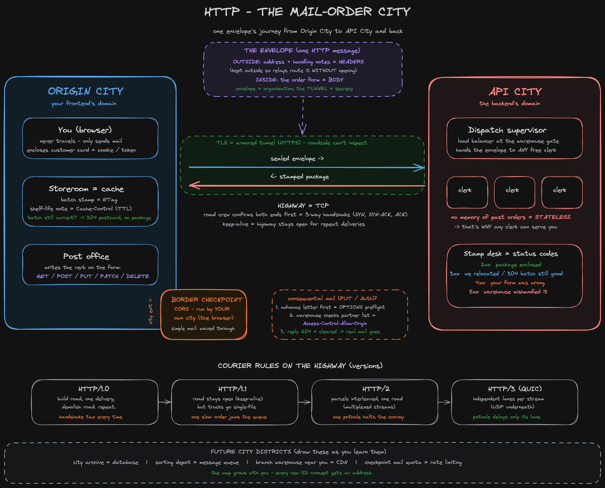

This post covers everything I have learned about <abbr title="HyperText Transfer Protocol">HTTP</abbr> so far. It is a living post; it will grow as I learn new concepts. The first half is the formal treatment, and the second half is the mental model I actually think in.

## Table of Contents

## What HTTP Is

HTTP is a **protocol**: a set of rules that standardises how a client and a server talk to each other. Two ideas define its character:

1. **Client–server model**: the client always initiates; the server only ever responds.
2. **Statelessness**: <mark>every request is processed in complete isolation, as if the server has never seen this client before</mark>. Any continuity (logins, sessions) must be carried by the client itself, typically as a cookie or session token attached to every request.

<aside class="callout-note">
  <strong>Note:</strong> Statelessness is a design superpower, not a limitation. Because no server needs memory of past requests, a load balancer can hand any request to any free server. This is what makes horizontal scaling possible.
</aside>

## Messages

Everything in HTTP is one of two message types: a **request** or a **response**. Both share the same anatomy:

- **Headers**: metadata on the outside for routing, control, and description. Headers give HTTP its _control_ (`Cache-Control`, `Authorization`, `Accept-Language`) and its _extensibility_ (custom `X-` headers).
- **Body**: the actual payload, whether form data, JSON, or HTML.

Headers stay outside the body because intermediaries along the route (proxies, load balancers, caches) must be able to route and handle the message _without opening it_.

## Methods: the Intent of an Action

The method is the verb of the request: it declares what you intend to do to the resource.

| Method | Idempotent | Meaning          |
| ------ | ---------- | ---------------- |
| GET    | Yes        | Read             |
| POST   | No         | Create           |
| PUT    | Yes        | Replace entirely |
| PATCH  | No         | Partial update   |
| DELETE | Yes        | Remove           |

**Idempotent** means repeating the operation lands you in the same end state as doing it once.

<aside class="callout-tip">
  <strong>Tip:</strong> Idempotency is the retry rule. A PUT that times out is safe to blindly retry, since the end state is identical. A POST that times out is not: retrying may create the resource twice.
</aside>

There is one more method worth knowing: `OPTIONS`. It performs no action on a resource. Instead, it asks the server _"what am I allowed to do here?"_ Its most common job is the <abbr title="Cross-Origin Resource Sharing">CORS</abbr> preflight, covered below.

## Status Codes

Every response carries a three-digit verdict. The first digit tells you whose story it is:

| Family | Meaning      | Common examples         |
| ------ | ------------ | ----------------------- |
| 1xx    | Information  | 100 Continue            |
| 2xx    | Success      | 200, 201, 204           |
| 3xx    | Redirection  | 301, 302, 304           |
| 4xx    | Client error | 400, 401, 403, 404, 429 |
| 5xx    | Server error | 500, 502, 503, 504      |

A useful reading: 4xx means _"your request was wrong"_, while 5xx means _"your request was fine, we fumbled it"_.

## Caching

Caching is a negotiation between server and client to avoid re-sending data that hasn't changed. The server attaches two things to a response:

- An **ETag**: a hash identifying this exact version of the data.
- A **Cache-Control** header: how long the copy can be trusted (its <abbr title="Time To Live">TTL</abbr>).

While the TTL is fresh, the client doesn't even ask; it reuses its local copy. After that, it revalidates: it sends the ETag back in an `If-None-Match` header, asking _"is my version still current?"_ If yes, the server replies **304 Not Modified** with an _empty body_. A receipt, not a package. Bytes on the wire drop from kilograms to grams.

## CORS: Cross-Origin Resource Sharing

Browsers enforce the **same-origin policy**: by default, JavaScript on one origin cannot read responses from another origin. CORS is the trust-establishment mechanism that relaxes this, and crucially, <mark>CORS is enforced by the browser, not the server</mark>.

Every cross-origin request falls into one of two classes:

1. **Simple requests**: plain GET/POST with standard headers. Sent directly.
2. **Preflighted requests**: anything consequential (PUT, DELETE, custom headers, `Authorization`). The browser first sends an `OPTIONS` request announcing what it intends (`Access-Control-Request-Method`, `Access-Control-Request-Headers`). The server answers with its allow-list (`Access-Control-Allow-Origin`, et al.). Only if the answer clears does the real request go out.

Most real-world requests end up preflighted, because the "simple" classification rules are narrow.

<aside class="callout-warning">
  <strong>Warning:</strong> A CORS failure doesn't always mean the request never reached the server. For simple requests the server may receive and process it; the browser then blocks your JavaScript from <em>reading</em> the response. CORS gates the reading, not always the sending.
</aside>

## Content Negotiation

The client can state its preferences in request headers, and the server serves the best match it can:

- `Accept`: preferred format (JSON, HTML, …)
- `Accept-Language`: preferred language
- `Accept-Encoding`: preferred compression (gzip, br, …)

## Persistent Connections & Keep-Alive

HTTP rides on <abbr title="Transmission Control Protocol">TCP</abbr>, and opening a TCP connection costs a round trip: the three-way handshake (SYN → SYN-ACK → ACK). **Keep-alive** (default since HTTP/1.1) holds the connection open across requests until one side explicitly closes it, paying the handshake tax once instead of per request.

How each HTTP version uses that connection is its own story:

| Version        | Connection behaviour                            | Weakness                                               |
| -------------- | ----------------------------------------------- | ------------------------------------------------------ |
| HTTP/1.0       | New connection per request                      | Handshake tax on every request                         |
| HTTP/1.1       | Keep-alive, but requests queue single-file      | One slow response blocks the rest (HOL blocking)       |
| HTTP/2         | Multiplexing: streams interleaved on one TCP    | One lost TCP packet stalls all streams (TCP-level HOL) |
| HTTP/3 (QUIC)  | Independent streams over UDP                    | Loss in one stream delays only that stream             |

## Handling Large Requests & Responses

- **Multipart requests**: one request split into labelled parts. This is how file uploads travel.
- **Streaming responses**: the server sends as it produces, instead of buffering the full payload first.

## HTTPS

> HTTPS = HTTP + <abbr title="Transport Layer Security">TLS</abbr>

TLS wraps the connection in encryption. One extra negotiation up front, and after that nothing in transit can be inspected along the way. Without it, headers and body alike travel in the clear. <mark>The message envelope is organisation, not secrecy; secrecy comes only from TLS</mark>.

---

## The Mental Model: Mail-Order City

> Part of [[System Design City]], the master metaphor. HTTP is the postal system between cities.

**You are a citizen of Origin City** (your frontend's domain). You never travel yourself; you only send mail. **API City** has a **mail-order warehouse** (the server): you post order forms to it, it posts packages back.

<blockquote class="pull-quote">
  Every envelope is processed as if from a complete stranger, and that is precisely why any clerk can serve you.
</blockquote>

### Statelessness: clerks with no memory

The clerks at the warehouse have no memory. If you're a returning customer, _you_ must enclose your customer card (cookie / session token) in every envelope, because the warehouse keeps no customer register. Since no clerk needs history, the **dispatch supervisor** at the entrance (load balancer) hands your envelope to _any_ free clerk.

### The highway: TCP

Before the first envelope moves, both ends confirm the highway is open via the three-way handshake. HTTP/1.0 tore the highway up after every delivery; **keep-alive** is the standing arrangement that leaves it open.

### The armored route: TLS

TLS turns the highway into a covered, armored route. Without it, everything travels in open trucks, and the sealed envelope is see-through in transit.

### The envelope: message structure

Address and handling instructions go on the **outside** (headers), because sorting offices and relays along the route must route it _without opening it_. The order form is **inside** (body).

### The verb on the order form: methods

| Method | Order form says                                           | Idempotent? |
| ------ | --------------------------------------------------------- | ----------- |
| GET    | "Send me your catalog page" (changes nothing)             | Yes         |
| POST   | "New order" (mail twice, two packages ship)               | No          |
| PUT    | "Make my standing order exactly this" (mail twice, same)  | Yes         |
| PATCH  | "Change one item on my standing order"                    | No          |
| DELETE | "Cancel my standing order"                                | Yes         |

### The stamped notice: status codes

**2xx**: package enclosed. **3xx**: "we've relocated" (301 permanent, 302 temporary), or the caching postcard (304). **4xx**: "your form was filled out wrong". **5xx**: "warehouse error, we mishandled it".

### The storeroom: caching

Your home storeroom is the cache. Every package arrives with a **batch stamp** (ETag) and a **shelf-life note** (Cache-Control). Instead of reordering, you mail just the batch stamp (`If-None-Match`): _"is my batch still current?"_ If yes, back comes a **postcard with no package attached**: **304 Not Modified**.

### The border checkpoint: CORS

The checkpoint sits at **Origin City's exit** and is staffed by _your own city's_ officials, meaning the browser, not the server. Mail within your own city never sees it. Routine cross-city mail (simple requests) is waved through. Consequential mail requires an **advance letter** first (the `OPTIONS` preflight), and the warehouse consults its posted partner-city list (`Access-Control-Allow-Origin`) before clearing it. And sometimes the warehouse ships the package anyway, but your own checkpoint impounds it on return: CORS blocks the _reading_, not always the _sending_.

### Courier rules on the highway: HTTP versions

HTTP/1.0: one truck, one delivery, rebuild the road. HTTP/1.1: road stays open, but trucks travel single-file. HTTP/2: parcels interleaved in shared trucks, but one pothole halts the whole convoy. HTTP/3 (QUIC): independent lanes per stream, so a pothole in one lane delays only that lane.

### Large deliveries

Multipart requests are one order split across several labelled parcels; streaming responses are the warehouse shipping as it packs.

  
The legend: full city-to-concept mapping

| City element                                 | Concept                            |
| -------------------------------------------- | ---------------------------------- |
| Origin City / API City                       | Origins (domains)                  |
| You, a citizen who only sends mail           | Browser / client                   |
| Mail-order warehouse                         | Server                             |
| Clerks with no memory of past orders         | Statelessness                      |
| Customer card you enclose each time          | Cookie / session token             |
| Dispatch supervisor assigning clerks         | Load balancer                      |
| Highway between cities                       | TCP connection                     |
| Confirming the highway is open               | 3-way handshake                    |
| Standing arrangement, road stays open        | Keep-alive / persistent connection |
| Covered, armored route                       | TLS (HTTPS)                        |
| Sealed envelope                              | HTTP message                       |
| Address & instructions on the outside        | Headers                            |
| Order form inside                            | Body                               |
| Verb on the order form                       | Method (GET/POST/PUT/PATCH/DELETE) |
| Stamped notice on the reply                  | Status code family                 |
| Home storeroom + batch stamp                 | Cache + ETag / Cache-Control       |
| Postcard, no package attached                | 304 Not Modified                   |
| Checkpoint at your city's exit               | CORS (browser-enforced)            |
| Advance letter before consequential mail     | OPTIONS preflight                  |
| Warehouse's posted partner-city list         | Access-Control-Allow-Origin        |
| Courier rules on the shared highway          | HTTP versions 1.0 → 1.1 → 2 → 3    |

  
Future city extensions: system design roadmap

- **City archive / records office** → Database
- **Sorting depot where mail waits** → Message queue (Kafka/SQS)
- **Regional branch warehouses near your city** → CDN
- **Checkpoint's daily mail quota** → Rate limiting
- **Multiple warehouses, supervisor picks one** → Horizontal scaling + load balancing

---

## Retention Checks

Answer from memory:

1. Narrate one envelope's full round trip: highway opening → checkpoint → warehouse → stamped reply.
2. Why is PUT safe to retry on a timeout but POST isn't?
3. What's the difference between 301, 302, and 304?
4. Why doesn't keep-alive fix head-of-line blocking? Why doesn't HTTP/2 fully fix it either? What does HTTP/3 change?
5. When does a CORS preflight fire, and who enforces CORS: browser or server?
6. A CDN asset hasn't changed in 6 months; the client sends `If-None-Match` with its ETag. What comes back, and what's in the body?

> Rule of thumb: wherever you stall while narrating, that's the concept to revisit. Nothing else.

---

## The Map

<figcaption>The whole model on one map: envelope, highway, checkpoint, warehouse, and the courier rules across HTTP versions.</figcaption>

---

**Links**: [[System Design City]] · [[TCP-IP]] · [[System Design - Caching]] · [[System Design - Load Balancing]]
