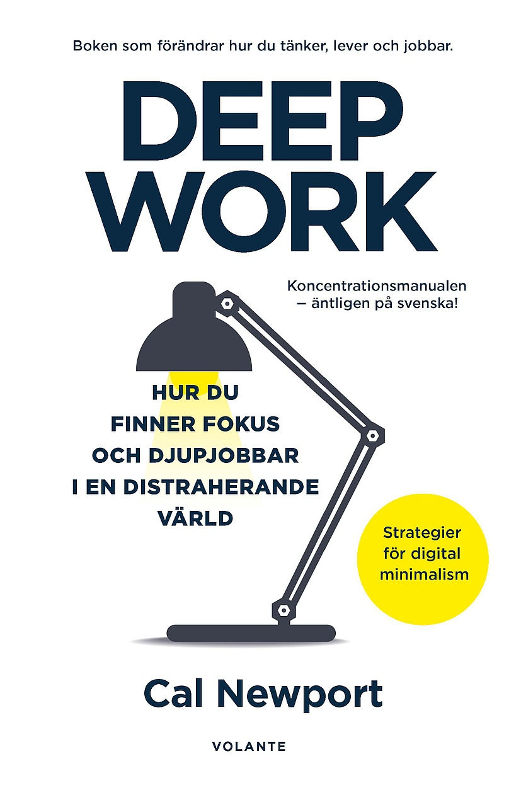

This post is a living reference — not meant to be published, but to preview how every text element renders. Open it in dev mode to see how things look before using them in a real post.

## Table of Contents

## Inline Text Elements

### Highlight — `<mark>`

Use `<mark>` to call out a key idea mid-sentence without breaking flow.

Reading through the notebook, one phrase kept surfacing: <mark>attention is the rarest form of generosity</mark>. I hadn't thought of it that way before.

---

### Underline — `<u>`

Use `<u>` for non-hyperlink emphasis. Distinct from links (which are coloured brass and underline on hover).

There's a difference between being <u>busy</u> and being <u>productive</u> — most of the time I'm confusing the two.

---

### Strikethrough — `<s>`

Use `<s>` for casual crossed-out thoughts, things you've changed your mind about.

The plan was to wake up early, write for an hour, <s>check Twitter</s>, then start the real work.

---

### Deleted — `<del>`

Use `<del>` for explicit corrections or tracked changes. More deliberate than `<s>`.

The original estimate was <del>three weeks</del> — it took three months.

---

### Inserted — `<ins>`

Use `<ins>` for explicitly added content. Often paired with `<del>`.

Price was <del>$120</del> <ins>$85</ins> after the discount.

---

### Superscript — `<sup>`

Use `<sup>` for footnote references, ordinals, and exponents.

The idea comes from Simone Weil's notebooks,<sup><a href="#fn-1" id="fnref-1">1</a></sup> though I encountered it second-hand. She wrote it sometime in the early 1940s<sup>2</sup>, during the war.

The formula is x<sup>2</sup> + y<sup>2</sup> = r<sup>2</sup>.

---

### Subscript — `<sub>`

Use `<sub>` for chemical notation or mathematical expressions.

Water is H<sub>2</sub>O. Carbon dioxide is CO<sub>2</sub>. The base of natural log is e<sub>0</sub>.

---

### Keyboard Key — `<kbd>`

Use `<kbd>` when writing about keyboard shortcuts or key combinations.

To save without leaving the editor, press <kbd>Cmd</kbd> + <kbd>S</kbd>. To open the command palette, use <kbd>Cmd</kbd> + <kbd>Shift</kbd> + <kbd>P</kbd>.

---

### Abbreviation — `<abbr>`

Use `<abbr title="...">` for acronyms. Hover to see the full form.

I've been thinking about <abbr title="Deep Work">DW</abbr> protocols and how <abbr title="Pomodoro Technique">PT</abbr> fits — or doesn't — into a longer writing session. <abbr title="Too Long; Didn't Read">TL;DR</abbr>: it doesn't.

---

### Citation — `<cite>`

Use `<cite>` for book titles, article names, films, or other works referenced in prose.

I keep returning to <cite>The Shallows</cite> by Nicholas Carr and <cite>A Room of One's Own</cite> by Virginia Woolf. Both are making the same argument about attention, decades apart.

---

### Small Print — `<small>`

Use `<small>` for asides, disclaimers, or tangential remarks that don't need full prominence.

This method works well for short sessions. <small>Results may vary depending on ambient noise, sleep quality, and how many tabs you have open.</small>

---

## Block Elements

### Callout — Note

<aside class="callout-note">
  <strong>Note:</strong> The <code>_drafts/</code> directory is excluded from the glob loader — files there are not processed as content entries and won't appear anywhere on the site, even in dev mode. Use <code>draft: true</code> in frontmatter if you want dev-only preview.
</aside>

---

### Callout — Warning

<aside class="callout-warning">
  <strong>Warning:</strong> Changing <code>pubDatetime</code> on a published post will affect its sort order in the feed and may break external links if your slug changes.
</aside>

---

### Callout — Tip

<aside class="callout-tip">
  <strong>Tip:</strong> Run <code>pnpm add-book &lt;isbn&gt;</code> to automatically fetch book metadata, download the cover image, and generate the library entry — no manual frontmatter needed.
</aside>

---

### Pull Quote

A pull quote lifts a key sentence out of the body for visual emphasis. Use sparingly — once per post at most.

<blockquote class="pull-quote">
  Attention is the rarest and purest form of generosity.
</blockquote>

The line above is from Simone Weil. I've been turning it over for weeks.

---

### Standard Blockquote

For comparison — this is the regular `>` blockquote. Wine-coloured italic text with a brass left border.

> The present moment always will have been. Whatever you do now is permanent in that sense — it joins the record of what happened.

---

### Footnotes

<section class="footnotes">
  <ol>
    <li id="fn-1">Weil, S. (1952). <cite>Waiting for God</cite>. G.P. Putnam's Sons. The phrase appears in her letter on attention and prayer. <a href="#fnref-1">↩</a></li>
  </ol>
</section>

---

## Already-Supported Elements

These work out of the box with standard markdown syntax.

### Bold and Italic

**Bold text** is weight 700 in the primary text colour. *Italic text* is simply font-style italic. They can be **combined *together*** if needed.

### Inline Code

Inline `code` renders with a dark background and subtle border. Use it for `file names`, `variable names`, or short `commands`.

### Code Block

```typescript file="src/config.ts"
export const SITE = {
  title: "The Inner Dialogue",
  author: "Khushil Kataria",
  timezone: "Asia/Kolkata", // [!code highlight]
  lightAndDarkMode: false,  // [!code ++]
};
```

### Lists

Unordered:

- First item with brass marker
- Second item
  - Nested item
  - Another nested item
- Third item

Ordered:

1. Step one
2. Step two
3. Step three

### Table

| Element | Syntax | Use case |
|---|---|---|
| Highlight | `<mark>` | Key ideas, annotations |
| Keyboard | `<kbd>` | Shortcuts, key combos |
| Citation | `<cite>` | Book and article titles |

### Image with Caption


<figcaption>Caption text goes here — rendered in muted small text, centred.</figcaption>

### Horizontal Rule

---

### Collapsible Section

<details>
  <summary>Click to expand</summary>

  Hidden content lives here. Useful for long asides, tangents, or supplementary material that breaks the main flow.

</details>
