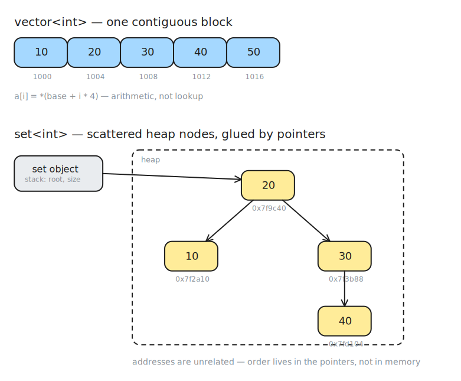
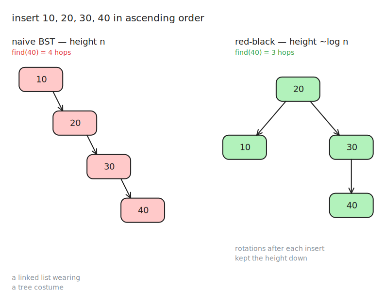
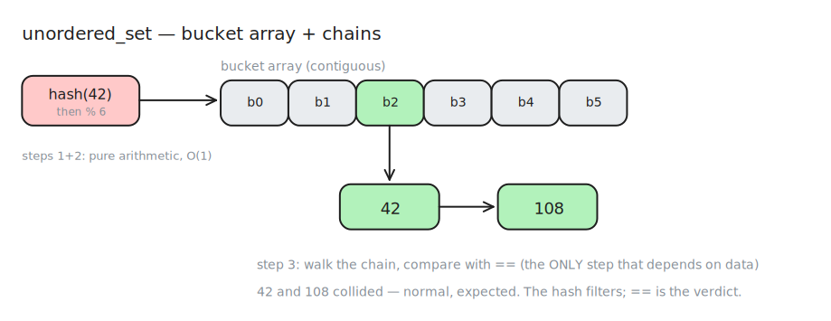
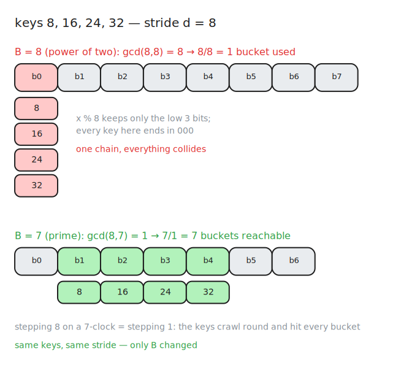
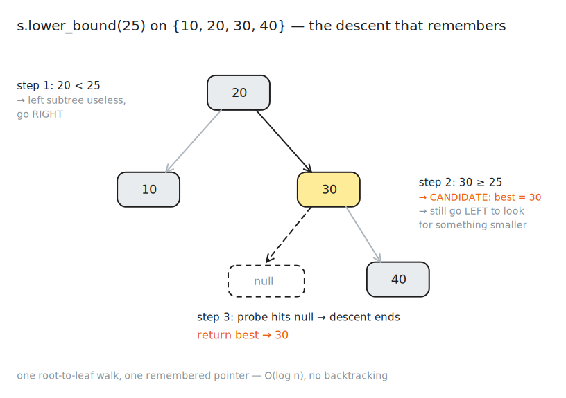

_How sets and maps are stored, why their complexities are what they are, and where they break. Covers `set`, `unordered_set`, `map`, `unordered_map`, all four `multi` variants, and the `lower_bound` descent. The remaining API surface (insert hints, erase idioms, C++20 niceties) is left for the next session — this note is about the machine underneath._

## Table of contents

## 1. Why sets exist — what an array can't do

An array gives you three things: store elements, access by **index** in O(1), iterate.

Two questions it answers badly:

- _"Is value `x` present?"_ → O(n) scan. O(log n) if you keep it sorted, but then…
- _"Insert `x`, keeping it sorted"_ → O(n), because you must shift elements.

A set is what you get when you decide **the thing you want to look things up by is the value, not the position.** Once you make that decision, contiguity stops being useful, and you are free to scatter the elements in memory.

Everything else in this note is a consequence of that one choice.

---

## 2. How an array is actually stored

```cpp
int a[5] = {10, 20, 30, 40, 50};
```

The compiler reserves 5 × 4 = 20 bytes in one unbroken run. If `a` starts at address 1000:

| address | 1000 | 1004 | 1008 | 1012 | 1016 |
| ------- | ---- | ---- | ---- | ---- | ---- |
| value   | 10   | 20   | 30   | 40   | 50   |

`a[i]` is **not a lookup — it is arithmetic**:

```
address = base + i * sizeof(int)
```

One multiply, one add, one memory read. That is why it is O(1), and it is O(1) **only because** elements are equally sized and adjacent. The index is a coordinate in memory.

**Buys:** O(1) by position; excellent cache behaviour (loading address 1000 pulls a whole 64-byte cache line, so 1004, 1008… come along free).

**Costs:** middle insert = physically shifting bytes; search by value = scanning; growth = reallocate and copy.

---

## 3. How `std::set` is actually stored

`std::set` allocates **each element in its own separate heap node**:

```cpp
struct Node {
    Node* parent;
    Node* left;
    Node* right;
    bool  color;   // red or black
    T     value;
};
```

A `set<int>` holding {10, 20, 30} is **not** 12 bytes in a row. It is three ~40-byte blobs sitting wherever `operator new` put them — say `0x7f2a10`, `0x7f9c40`, `0x7f3b88` — glued together by **pointers**, not by adjacency.

The container object itself (on your stack, `sizeof(set<int>)` ≈ 48 bytes) holds essentially just a **root pointer** and a **size counter**. All data lives on the heap.

```
   set object (stack)
        │ root
        ▼
       [20]                     ← 0x7f9c40
      /    \
   [10]    [30]                 ← 0x7f2a10, 0x7f3b88
              \
              [40]              ← 0x7fd104
```

Adjacency in the drawing is a lie. Adjacency in the _ordering_ is the only adjacency that exists.



---

## 4. The BST property — the correctness invariant

> For every node: everything in its **left subtree is smaller**, everything in its **right subtree is larger**.

This is what makes lookup _possible at all_. It is the rule that lets you say "go left" or "go right" instead of checking both sides. Without it you would have to visit every node — the tree would be a worse array.

To find 30 in the tree above: start at root (20), 30 > 20 → right, arrive at 30. Two steps instead of four.

**If this invariant breaks, the set gives wrong answers.**

---

## 5. Red-black — the performance invariant

The BST property alone is not enough. Insert 10, 20, 30, 40 in ascending order into a naive BST:

```
[10]
   \
   [20]
      \
      [30]
         \
         [40]
```

A linked list wearing a tree costume. Height = n. `find(40)` = 4 hops. Every operation is back to O(n). **Sorted input is the worst possible input for a naive BST** — and sorted input is extremely common in practice.



Red-black trees fix this. Each node stores **one bit of colour** (red or black), and after every insert and erase the tree performs local **recolours** and **rotations** to maintain two rules:

> **Rule 1 — no red-red:** a red node cannot have a red parent. (No two reds adjacent on any path.)
>
> **Rule 2 — equal black-height:** every path from a given node down to any leaf passes through the **same number of black nodes**.

### The derivation — where the "2×" comes from

Neither rule mentions height. The height bound is a _consequence_:

- By Rule 2, every root-to-leaf path contains exactly the same number of black nodes. Call it `b`.
- By Rule 1, reds can never be adjacent — so on any path, at most every _other_ node is red.
- Therefore the **shortest** possible path is all-black: `b` nodes.
- And the **longest** possible path alternates black-red-black-red…: `2b` nodes.

```
longest path ≤ 2 × shortest path
```

Since a tree of n nodes has shortest path ≥ log₂(n), the longest path — the height — is bounded by ~2·log₂(n) = **O(log n)**.

**This is the key idea.** You enforce two cheap, purely _local_ rules that a node can check against its immediate neighbours, and you get a _global_ height guarantee for free. No implementation ever measures "is this path more than twice that one?" — it never has to.

> **Common misreading:** the guarantee is **not** "root-to-leaf distance ≤ 2". That would cap the tree at ~4 elements. It is a **ratio**: longest ≤ 2 × shortest.

Recolouring alone usually fixes a Rule-1 violation. A **rotation** is needed only when recolouring would break Rule 2.

### What breaks if each invariant breaks

| Broken invariant | Consequence                                             |
| ---------------- | ------------------------------------------------------- |
| BST property     | The set is **wrong** — `find` returns incorrect answers |
| Red-black rules  | The set is **right but slow** — degenerates toward O(n) |

---

## 6. Height vs size — two different n's

Keep these strictly separate. People conflate them constantly.

- **Height** (log n) governs **targeted** operations: `find`, `insert`, `erase`. You descend _one path_.
- **Size** (n) governs **exhaustive** operations: iteration, counting, copying. You visit _every node_.

Balancing shrinks the **height**. It does nothing to the **size**. No amount of rotation makes "print all elements" faster than O(n) — you must touch each one.

So: `find` is O(log n). Full traversal is O(n). Both true, no contradiction.

---

## 7. The hidden cost: cache behaviour

Big-O hides this, and it matters enormously in low-latency work.

Every hop down a tree is a **pointer dereference to an address unrelated to the previous one**. That's a likely cache miss — roughly 100 ns of stalled CPU.

- Array scan of 100 ints: 100 comparisons, but only **1–2 cache misses** (the data is contiguous).
- Set lookup among 100 elements: ~7 comparisons, but ~**7 cache misses**.

Which is why, **for small n, a sorted `vector` beats a `set` in wall-clock time despite worse asymptotics.** Big-O counts comparisons; the CPU charges you for memory access.

---

## 8. How `std::unordered_set` is actually stored

Completely different machine. The idea: _get the array's arithmetic shortcut back, by computing the index from the value itself._

```
index = hash(value) % bucket_count
```

The container holds a **contiguous array of buckets**. Each bucket is a pointer to a linked list (a **chain**) of nodes whose values hashed there.

```
hash(42) → huge number → % 6 → bucket 2

buckets:  [0] [1] [2] [3] [4] [5]      ← contiguous array
                   │
                   ▼
                  [42] → [108]          ← chain (these collided)
```



A lookup is exactly three steps:

```
1. h = hash(x)              // arithmetic on the value — O(1), independent of n
2. b = h % bucket_count     // one modulo → an array offset — O(1)
3. walk bucket[b]'s chain, comparing values with ==
```

Steps 1 and 2 are **unconditionally O(1)** — hashing an `int` costs the same whether the container holds 5 or 5 million elements. Step 2 is literally the array's arithmetic shortcut, recovered.

> **The entire complexity question collapses to one thing: how long is the chain at step 3?**
>
> Chain ~1 → O(1). Chain ~n → O(n). Everything else is bookkeeping to keep chains short.

**Collisions are normal.** Two different values sharing a bucket is expected, not a bug. That's why step 3 exists.

---

## 9. Load factor and rehashing

Assume the hash spreads values uniformly. Then with `n` elements over `B` buckets, the **expected chain length** is just "n items shared out over B slots":

```
λ  =  load factor  =  n / B      →      expected chain length = λ
```

So the container's whole job is to bound λ. It watches λ after every insert. When λ exceeds `max_load_factor` (**default 1.0**), it **rehashes**:

```
if (size / bucket_count) > max_load_factor:
    target = next prime in table ≥ max(size / max_load_factor, 2 × bucket_count)
    allocate that many buckets
    for every element: recompute hash(x) % new_bucket_count, relink
```

**λ ≤ 1 means expected chain length ≤ 1.** That is the O(1).

Note how load-bearing the word **expected** is. It is an average over a _hypothetical uniform hash_. It is **not** a guarantee about your data. That gap is §15.

**Who picks the bucket count?** The container, automatically, on insert. You never choose it directly. You can only influence it:

| Call                     | Effect                                                             |
| ------------------------ | ------------------------------------------------------------------ |
| `s.reserve(n)`           | Pre-size for n elements — **skips all future rehashes**. Use this. |
| `s.rehash(k)`            | Force at least k buckets.                                          |
| `s.max_load_factor(0.5)` | Change the trigger threshold.                                      |

---

## 10. Why "amortized" O(1), not O(1)

A rehash is O(n) — it touches every element. Why doesn't that ruin the average?

**The doubling argument.** Bucket count roughly doubles each rehash, so rehashes happen at sizes ~1, 2, 4, 8, …, n. Total rehash work over n inserts:

```
1 + 2 + 4 + 8 + … + n  <  2n
```

A geometric series with ratio 2 sums to less than twice its last term. So **all rehashing ever done, summed, is O(n)** — spread over n inserts, that's **O(1) each**. The rare expensive operations are paid for by the many cheap ones.

That is what _amortized_ means: **the average over a sequence is O(1), even though an individual operation can be O(n).**

### Why this matters for low-latency work

Amortized O(1) is fine for a competitive-programming solve and **unacceptable on a hot path**. If insert #65,536 triggers a rehash that reallocates and relinks 65,536 nodes, you just ate a multi-microsecond stall in a system budgeting nanoseconds.

**The mean is beautiful; the tail is what kills you.**

Mitigation: `s.reserve(expected_n)` up front — pre-size the bucket array so no rehash ever fires. (Same reasoning as `vector::reserve`.) This is also why HFT shops frequently refuse `std::unordered_map` outright in favour of open-addressed flat tables with fixed capacity.

---

## 11. Space cost: buckets ≈ elements

With `max_load_factor = 1.0`, the container keeps **roughly as many bucket slots as elements**. For 1M `int`s:

- ~1M bucket slots × 8 bytes (each a pointer) = **8 MB of pointer array, much of it pointing at nothing**
- ~1M nodes × (4-byte value + 8-byte next-pointer + allocator overhead) ≈ **32 MB**

≈ **40 MB to store 4 MB of ints.** The buckets are pure overhead — they exist only so the modulo lands somewhere useful.

`max_load_factor` is the dial on this trade-off:

| λ   | buckets | expected chain | effect                                |
| --- | ------- | -------------- | ------------------------------------- |
| 0.5 | 2n      | 0.5            | more memory, fewer collisions, faster |
| 1.0 | n       | 1              | the default                           |
| 4.0 | n/4     | 4              | less memory, longer chains, slower    |

**You are literally buying speed with empty memory.** That's the hash table's bargain: a `set` stores exactly n nodes and pays log n in time; an `unordered_set` stores n nodes _plus_ ~n mostly-empty slots and pays O(1). Space for time, made explicit.

---

## 12. Modulo is a clock — the gcd derivation

This is the heart of why bucket count matters. Build it from nothing.

### Modulo is a clock

`x % B` means: walk x steps around a clock with **B positions**, starting at 0. Where do you stop?

`17 % 12 = 5` — go 17 hours around a 12-hour clock, land on 5. That's all it is.

**Hashing keys into buckets is this clock.** B buckets = a clock with B positions.

### Real keys are evenly spaced

Keys are rarely random. They're structured: IDs incrementing by 1, timestamps in ms, pointers aligned to 16 bytes, prices in ticks of 25. Structured means **arithmetic progression**: some base `a` plus multiples of a **stride** `d`.

Keys `0, 8, 16, 24, 32, …` have stride **d = 8**.

On the clock, each successive key lands **d positions further round** than the previous one. So you're not placing keys randomly — **you are taking repeated steps of size d around a B-position clock.**

The question becomes: **how many distinct positions do you ever land on?**

### Just do it — B = 8, d = 8

```
start:  0
+8  →   8 % 8 = 0
+8  →  16 % 8 = 0
+8  →  24 % 8 = 0
```

Stepping 8 on an 8-clock takes you all the way around and back to where you started. **You never leave position 0.** One bucket, forever.

### Same stride — B = 7, d = 8

```
start:  0
+8  →   8 % 7 = 1
+8  →  16 % 7 = 2
+8  →  24 % 7 = 3
+8  →  32 % 7 = 4
```

Stepping 8 on a 7-clock is really stepping 8 − 7 = **1** each time. You crawl round the whole clock and hit **every** position.

**Same keys. Same stride. Only B changed — and the result went from total collapse to perfect spread.**



### Where gcd comes from

Why did 8 fail and 7 work?

> A step of size `d` on a clock of size `B` can only ever reach positions that are **multiples of gcd(d, B)**.

**Reason, without algebra:** every position you can reach has the form `k·d − m·B` for whole numbers k, m (you step forward by d, you wrap backward by B). But `d` and `B` are **both multiples of their gcd** — call it `g`. Any sum or difference of multiples of g is itself a multiple of g. **You are physically incapable of landing anywhere that isn't a multiple of g.**

On a clock of size B, the positions that are multiples of g number exactly:

```
                B / g          distinct reachable buckets
```

Check it:

| B   | d   | g = gcd(d,B) | reachable = B/g | outcome             |
| --- | --- | ------------ | --------------- | ------------------- |
| 8   | 8   | 8            | 8/8 = **1**     | total collapse ✓    |
| 7   | 8   | 1            | 7/1 = **7**     | perfect spread ✓    |
| 12  | 3   | 3            | 12/3 = **4**    | uses ⅓ of the table |
| 12  | 5   | 1            | 12/1 = **12**   | full spread         |

### The rule

> **You want gcd(d, B) = 1.** That is exactly when your keys use every bucket.
>
> If gcd(d, B) = g, you use only **1 in g** buckets, and your chains are **g× too long**.

**You do not control `d` — your data does.** The only lever you have is **B**.

---

## 13. Why a prime bucket count

So: which B makes gcd(d, B) = 1 for the most possible strides?

- **B = 2ᵏ:** shares a factor with **every even d**. Half of all strides fail — and the common ones (2, 4, 8, 16, 64 — alignments, powers, even IDs) fail _badly_.
- **B = prime:** shares a factor with **no d at all**, unless d happens to be a multiple of B itself. Almost nothing fails.

**That is the entire argument for primes.** A prime modulus is immune to _every_ arithmetic stride except one — and that one exception becomes §15.

### The cost of primes

|                      | modulo cost                                 | needs                    |
| -------------------- | ------------------------------------------- | ------------------------ |
| `x % 7` (prime)      | real integer division, **20–40 CPU cycles** | forgiving of weak hashes |
| `x % 8` (power of 2) | `x & 7` — **1 cycle**                       | demands a strong hash    |

This explains the two design philosophies you'll meet:

- **libstdc++**: prime buckets (slow modulo, forgiving) + **identity hash** for `int` (free). Robustness pushed into the **modulus**.
- **Abseil / folly / most HFT tables**: power-of-two buckets (bitmask, 1 cycle) + a strong **mixing** hash. Robustness pushed into the **hash**.

Both work. What does **not** work is a weak hash **and** a power-of-two modulus — which is, unfortunately, what MSVC historically shipped.

---

## 14. Power-of-two buckets = throwing away the high bits

When B = 2ᵏ, `x % B` isn't merely _related to_ the low bits — **it is the low bits, exactly.**

```
 8 = 0000 1000    →  8 % 8  →  keep low 3 bits  →  000  →  0
16 = 0001 0000    → 16 % 8  →  keep low 3 bits  →  000  →  0
24 = 0001 1000    → 24 % 8  →  keep low 3 bits  →  000  →  0
```

Why: `x % 8 == x & 7`. ANDing with `0000 0111` **masks off every bit above position 2**. All high bits go in the bin.

So if your keys are distinguished **only by their high bits** — which is precisely what "spaced 8 apart" means — the modulo **erases the only information that told them apart.** They arrive at the bucket array indistinguishable.

**Real cases where this bites:**

- heap pointers (16-byte aligned → low 4 bits always zero)
- cache-line addresses (64-byte aligned)
- IDs allocated in blocks
- prices in fixed ticks

All have structurally-zero low bits. All get flattened into one bucket by a power-of-two table with a weak hash.

A prime B **cannot** do this, because there is no bit-pattern that `% 7` corresponds to. It genuinely has to divide, and the remainder depends on **all** the bits of x.

> **That is the real content of "primes are forgiving": the modulo consults the whole number instead of a corner of it.**

---

## 15. The worst case: hash flooding

A prime B defeats every stride **except one**: a stride `d` that is a **multiple of B**. Then gcd(d, B) = B, and reachable buckets = B/B = **1**.

**Primes have exactly one blind spot, and it is `d = P` itself.**

So the attacker needs to know P. And they can:

1. **The prime table is hardcoded in the libstdc++ source, in plain sight:** 13, 29, 59, 127, 257, 541, 1109, 2357, 5087, 10273, 20753, 42043, 85229, 175003, …
2. **The growth rule is fixed:** on rehash, jump to the next prime ≥ ~2× current.
3. Therefore **bucket count is a pure function of n.** Same n → same P. Every run, every machine. **No randomness anywhere.**

### And `std::hash<int>` does nothing

```cpp
template<> struct hash<int> {
    size_t operator()(int x) const { return x; }   // identity!
};
```

In libstdc++, **your key _is_ your hash.** So `bucket = x % bucket_count`, full stop. There is no mixing step to break up the arithmetic structure.

### The attack

Attacker sees your problem has n = 10⁵, computes that the table settles at **P = 175003**, and hands you:

```
175003, 350006, 525009, 700012, …          (stride d = P)
```

`gcd(P, P) = P` → reachable buckets = P/P = **1**. Every key lands in bucket 0.

The k-th insert walks the chain, comparing against the k−1 keys already there:

```
0 + 1 + 2 + … + (n−1)  =  n(n−1)/2  ≈  n²/2
```

n = 10⁵ → **~5 × 10⁹ comparisons.** Your 30 ms solution TLEs.

### And the container never notices

λ = 100000 / 175003 ≈ **0.57** — comfortably under 1.0. **No rehash fires.** The container is perfectly happy.

> **The load factor is a global average, and averages are blind to skew.** The container has no idea that 175,002 of its buckets are empty and one is a linked list of length 100,000. The safety mechanism doesn't trigger because **the safety mechanism measures the wrong thing.**

---

## 16. Threat model — when this actually matters to you

The attack requires exactly one thing: **the adversary controls the keys.** Break that and it evaporates.

### When they DO control the keys

- **Codeforces hacking phase.** The purest case — they're literally handed a text box to write your input file.
- **Web services.** A real CVE class ("hash flooding", demonstrated across PHP, Python, Ruby, Java, Node in 2011). If you hash anything user-supplied — POST parameter names, HTTP headers, JSON object keys, usernames, cache keys derived from a URL — then **a request body is an attacker-chosen key set.** A single ~1 MB POST with colliding parameter names could pin a CPU core for minutes. This is why Python now randomizes its hash seed per process (`PYTHONHASHSEED`) and why several languages moved to SipHash — the same seeded-hash fix, adopted at the language level.

### When they DON'T

Keys from an internal counter, a database primary key, your own enum, a fixed config file. No adversary. Default `std::hash` is fine.

**But you can still lose by accident.** The mechanism does not care about malice — **it only cares about structure.** Benign keys are often highly structured: aligned pointers, IDs in blocks of 1000, ms timestamps, tick-sized prices. Those are strides. If your stride shares a factor with the bucket count, chains get long and **nobody attacked you — your data was just regular.**

| Failure mode    | Who supplies the stride     | Fix             |
| --------------- | --------------------------- | --------------- |
| **Adversarial** | an attacker, deliberately   | seeded hash     |
| **Accidental**  | your own domain's structure | a _mixing_ hash |

A good mixing hash fixes **both**. The random seed is only needed for the first.

### The severity bound

To fill one bucket with n keys, the attacker needs n distinct values all congruent mod P: `r, r+P, r+2P, …, r+(n−1)P`. The largest is ≈ **n·P**. So the attack needs the **key domain to be at least that wide.**

- If a problem says `aᵢ ≤ 10⁵` and the table settles at P = 175003, then **every key is smaller than P**, so `x % P == x`, so every key gets its own bucket. **Zero collisions. The attack is not mitigated — it is impossible.**
- If `aᵢ ≤ 10⁹`, they can pack ~10⁹ / 175003 ≈ **5,700 keys** into one residue class. Now n lookups each walk a chain of 5,700 → ~10⁸–10⁹ comparisons. Enough to blow a time limit.

> **The attack's severity is bounded by (key range) / (bucket count).**
> Wide key domain relative to n → dangerous. Narrow key domain → harmless, sometimes literally impossible.

### The practical rule (say this in an interview)

> `unordered_map` with the default hash is safe when the keys are **yours**, or when the **key range is small relative to the table**. It becomes unsafe the moment keys are **wide** _and_ **someone else picks them**. If either condition is uncertain, use a seeded mixing hash — it costs a few nanoseconds and removes the entire class of problem.

---

## 17. The fix: a seeded mixing hash

```cpp
struct SplitMix64 {
    size_t operator()(long long x) const {
        static const long long FIXED =
            chrono::steady_clock::now().time_since_epoch().count();
        x += FIXED;
        x += 0x9e3779b97f4a7c15;
        x = (x ^ (x >> 30)) * 0xbf58476d1ce4e5b9;
        x = (x ^ (x >> 27)) * 0x94d049bb133111eb;
        return x ^ (x >> 31);
    }
};

unordered_set<long long, SplitMix64> s;
```

Two separate defences, doing two separate jobs:

1. **The bit-mixing** (shifts + multiplies by odd constants) ensures **every input bit influences every output bit**. Nearby keys scatter. _This fixes the accidental case._
2. **The clock-derived seed** ensures the attacker **cannot precompute the collision set**, because the mapping differs on every run. _This fixes the adversarial case._

> **What the fix really does:** it breaks the **arithmetic relationship between the keys and the buckets before the modulo ever runs.** The attacker can pick any stride they like — after `splitmix64(x + seed)`, the values arriving at `% P` are **no longer in arithmetic progression at all**, so there is no gcd to exploit.
>
> You have stopped defending the _modulus_ and started defending the _input to_ the modulus — which is the only place the defence can be robust.

---

## 18. Duplicate detection — how both containers do it

Both check **at insertion time**. Neither runs a periodic dedup pass. In both, the check is **free** — not because it costs nothing, but because it costs **nothing extra**.

### `set` — the descent doubles as the check

To insert _anything_, the tree must first answer: **where does this node go?** There is exactly one legal slot, dictated by the BST property. Finding it means descending from the root, comparing at every node.

`s = {10, 20, 30, 40}`; call `s.insert(20)`:

```
at 20:  is 20 < 20?  no.
        is 20 > 20?  no.
        → neither → equivalent → STOP.
```

You never reached a leaf. **You never allocated a node.** Returns `{iterator_to_20, false}`.

Now `s.insert(25)`:

```
at 20:  25 > 20  → go right
at 30:  25 < 30  → go left
        left child is null → this is the slot
        → allocate node, attach, rebalance
```

Returns `{iterator_to_25, true}`.

> **There is no separate "check for duplicates" phase.** Duplicate detection **is** insertion, interrupted. You had to walk down the tree anyway to find the attachment point. If that walk ever hits an equivalent node, you have simultaneously discovered (a) the element already exists and (b) exactly where it is. **Two facts, zero extra comparisons.**

### `unordered_set` — the hash narrows, `==` decides

```
1. b = hash(x) % bucket_count      → narrows n candidates down to one chain
2. walk that chain, comparing each node with x using ==
3. if any matches → return {existing_iterator, false}
   else           → link a new node into the chain
```

Same principle: you had to walk the chain anyway to find the tail to append to. Any `==` match found on the way is a free duplicate detection.

> **The hash cannot decide duplication. It can only narrow the search.**
>
> Same hash does **not** mean same value — that's a **collision**, and collisions are normal. 42 and 108 may both live in bucket 2 and are obviously different elements. So after hashing, the container **must still compare with `==`** to know whether it's looking at a duplicate or just a roommate.
>
> **The hash is a filter. `==` is the verdict.**

This is also why `find` and `insert` have identical complexity in both containers: mechanically, they are almost the same function.

### `insert`'s return type tells you the outcome

```cpp
auto [it, inserted] = s.insert(25);   // pair<iterator, bool>
```

The bool **is** the container reporting the duplicate check.

And `multiset` / `unordered_multiset` simply **switch this branch off** — they always link the new node. Which is why _their_ `insert` returns a plain `iterator`, not a pair: there is no outcome to report, insertion always succeeds.

---

## 19. Equivalence vs equality — a real trap

**`set` never calls `operator==`.** It only knows `operator<` (or your comparator). So "same" is defined as:

```cpp
!(a < b) && !(b < a)
```

Neither is less than the other → they occupy the **same position in the ordering** → they are **equivalent**. That is the word the standard uses, and it is **not** the same as _equal_.

```cpp
struct Person { string name; int age; };

set<Person, decltype([](Person a, Person b){ return a.age < b.age; })> s;
```

Two people with the **same age but different names** are **equivalent** under this comparator. The set will hold **only one of them.** The other is silently rejected.

> **Your comparator defines identity.** If it compares fewer fields than you think, your set deduplicates more aggressively than you think.

`unordered_set` has no ordering available, so equivalence-by-`<` is impossible. It requires **two** things from your type instead:

- a **hash** (`std::hash` specialization or a custom functor)
- an **`operator==`** (the `KeyEqual` template parameter)

|                        | `set`                                   | `unordered_set`                |
| ---------------------- | --------------------------------------- | ------------------------------ |
| when checked           | during the descent                      | during the chain walk          |
| "same" means           | `!(a<b) && !(b<a)` — **equivalence**    | `a == b` — **equality**        |
| your type must provide | `operator<` (or a comparator)           | `operator==` **and** a hash    |
| cost of the check      | free — part of the descent              | free — part of the chain walk  |
| silently breaks when   | comparator isn't a strict weak ordering | hash is inconsistent with `==` |

This asymmetry is why `set` works out of the box for anything you can order, while `unordered_set` on a custom type demands you write a hash — there is no `std::hash<Point>`, and the compiler error you get is that missing specialization.

---

## 20. The hash contract

> ### If `a == b`, then `hash(a)` **must** equal `hash(b)`.

The **converse is not required** — unequal objects may share a hash. That's just a collision, handled by the chain walk.

But if two **equal** objects hash **differently**, they are sent to **different buckets**. The chain walk at insertion never sees the other one. **The duplicate check silently fails, and your `unordered_set` now contains two copies of the same value.**

The container will not warn you. It will not crash. **It will just quietly stop being a set.**

```cpp
struct Point {
    int x, y;
    bool operator==(const Point& p) const { return x == p.x && y == p.y; }
};

struct BadHash {   // CORRECT but SLOW
    size_t operator()(const Point& p) const { return p.x; }
};

struct GoodHash {  // correct and fast
    size_t operator()(const Point& p) const {
        return hash<int>()(p.x) ^ (hash<int>()(p.y) << 1);
    }
};
```

`BadHash` **satisfies the contract** — equal points have equal x, so they hash the same. It is merely _slow_ (every point on a vertical line collides).

A hash using `p.x + rand()` would be **incorrect** — it breaks the contract, and duplicates appear.

**Slow hash = performance bug. Inconsistent hash = correctness bug.** Know which one you're writing.

---

## 21. Iterators — what they actually are

Since `s[i]` is meaningless in both containers, C++ needs another way to say "this element, right here."

> **An iterator is a generalized pointer: an object that (a) knows how to dereference to an element, and (b) knows how to move to the next one.**

That is the entire contract. Every container implements it differently, but all expose the same syntax: `*it`, `++it`, `it != end`.

| container       | what the iterator holds         | what `++it` does                                                          |
| --------------- | ------------------------------- | ------------------------------------------------------------------------- |
| `vector`        | a raw pointer (or thin wrapper) | add `sizeof(T)` bytes                                                     |
| `set`           | a `Node*`                       | compute the **in-order successor**                                        |
| `unordered_set` | a node ptr + bucket index       | advance in chain; if exhausted, scan forward to the next non-empty bucket |

**Three totally different mechanisms, one identical syntax.** That's the abstraction — and it's why one algorithm template works on all of them.

### `++it` on a `set` is an algorithm, not arithmetic

There is no "next address." Incrementing runs the in-order successor:

```
if node has a right child:
    go right once, then left as far as possible
else:
    walk up through parents until you come up from a LEFT child
```

Worst case O(log n) for a single `++`, but **O(1) amortized across a full traversal** — a complete `for (int x : s)` walk is O(n) total.

And it emits elements in **sorted order**, because in-order traversal of a BST is sorted.

> **The sortedness is not stored anywhere. It is _produced_ by the walk.**

### Consequences

- **`s.begin()` is the leftmost node** (the minimum) — **not** "the first thing inserted."
- **`s.end()` is a sentinel** — a fake past-the-last position. Never dereference it. `it != s.end()` compares pointers, not indices.
- Set iterators are **bidirectional, not random-access**: `++it` and `--it` work; **`it + 3` does not compile**, because there's no way to jump 3 nodes without walking them. Hence no `s[i]`, and hence "k-th smallest element" is **O(k)**, not O(1).

---

## 22. Iterator invalidation

Falls straight out of the memory layouts.

| container       | operation                   | what happens                                                                                                                                                           |
| --------------- | --------------------------- | ---------------------------------------------------------------------------------------------------------------------------------------------------------------------- |
| `vector`        | reallocation on `push_back` | **all** iterators invalid — the whole block moved                                                                                                                      |
| `set`           | insert                      | **nothing** invalidated — nodes never move, rotations only relink pointers                                                                                             |
| `set`           | erase                       | **only** the iterator to the erased element                                                                                                                            |
| `unordered_set` | rehash                      | **all iterators** invalid (elements redistributed into a new bucket array) — but **pointers/references to elements stay valid**, since the nodes themselves don't move |
| `unordered_set` | erase                       | only the erased element's iterator                                                                                                                                     |

The `set` guarantee is unusually strong and genuinely useful: you can hold an iterator to an element across arbitrary inserts and erases of _other_ elements. This is what makes `set` viable as the backbone of things like LRU structures and sweep-line active sets.

---

## 23. The complexity table, and where every entry comes from

| Operation               | `vector` (sorted)      | `set`                                   | `unordered_set`                    |
| ----------------------- | ---------------------- | --------------------------------------- | ---------------------------------- |
| find                    | O(log n) binary search | O(log n) tree walk                      | **O(1) avg, O(n) worst**           |
| insert                  | O(n) — shift elements  | O(log n) + rebalance                    | O(1) amortized avg                 |
| erase                   | O(n) — shift elements  | O(log n)                                | O(1) avg                           |
| min / max               | O(1)                   | O(log n) — `*s.begin()` / `*s.rbegin()` | O(n)                               |
| iterate in sorted order | O(n)                   | O(n)                                    | **impossible**                     |
| next element ≥ x        | O(log n)               | O(log n)                                | **impossible**                     |
| k-th smallest           | O(1)                   | O(k)                                    | —                                  |
| memory per element      | just the value         | value + 3 pointers + colour bit         | value + 1 pointer + ~1 bucket slot |
| cache behaviour         | excellent              | poor                                    | mediocre                           |

**Every entry falls out of the memory layout:**

- **Contiguity** gives arithmetic indexing and cache locality.
- **Pointers** give cheap structural edits and ordering.
- **Hashing** gives arithmetic back — but _destroys ordering_ to get it.

"Impossible" is not an API oversight. The hash **deliberately scatters**: 10 and 11 land in unrelated buckets. There is no meaningful "next larger element" to walk to. `lower_bound` **cannot exist** on `unordered_set` — not as a design decision, but as a **structural impossibility**.

### The asymmetry that is the whole point

|                 | best/average | worst                                  |
| --------------- | ------------ | -------------------------------------- |
| `set`           | O(log n)     | **O(log n) — structurally guaranteed** |
| `unordered_set` | O(1)         | O(n) — depends on the hash             |

- A red-black tree's bound comes from an **invariant the container enforces itself** on every mutation. It **cannot be tricked**, because it rebalances based on its own structure, not on your data's statistics.
- A hash table's bound comes from a **statistical assumption about data it does not control**. That assumption holds by default, fails against adversarial or structured input, and **the container has no way to notice.**

> **`unordered_set` is faster in the common case and gives you no floor. `set` is slower in the common case and gives you a hard ceiling.**

That sentence is why _"just use `unordered_map`, it's O(1)"_ is a bad reflex — and it's exactly the trade-off a good interviewer will probe.

---

## 24. Decision rules

**Use `unordered_set` when:**

- You only ever ask _"is x in here?"_
- Keys are yours, or the key range is narrow relative to n
- You can call `reserve()` up front

**Use `set` when:**

- You need **order**: sorted iteration, min/max, or "nearest value ≥ x"
- You need a **worst-case guarantee** (adversarial input, or a latency SLA)
- You need **iterator stability** across inserts/erases

**Use a sorted `vector` when:**

- n is small (cache locality wins outright)
- The data is built once and then only queried (`sort` + `binary_search` beats both)

**Reach for a custom seeded hash when:**

- Keys are attacker-supplied, **or**
- Keys are structured (aligned pointers, block-allocated IDs, tick prices) and you're seeing unexplained slowness

---

## 25. The one-paragraph summary

An array indexes by **position**, so it can compute an address. A set indexes by **value**, so it cannot — and everything follows from how it gets around that. `std::set` gives up contiguity entirely and stores elements as heap nodes in a **red-black tree**, whose two local colour rules (no red-red; equal black-height) force the longest root-to-leaf path to be at most twice the shortest, bounding height at **O(log n)** — a guarantee that holds _regardless of the data_, because the tree rebalances on its own structure. `std::unordered_set` recovers the array's arithmetic shortcut by computing the index from the value: `hash(x) % B`. That is O(1), but only if chains stay short, which requires the hash to **spread** — and spreading is a statement about **your data**, not about the container. Since real keys arrive in arithmetic progressions with some stride `d`, and stepping by `d` around a `B`-position clock reaches only **B / gcd(d, B)** buckets, the bucket count `B` must share no factor with `d`. **Prime B** achieves this for every stride except `d = P` itself — which is precisely the hole that hash-flooding attacks drive through, since the prime table and growth policy are public and deterministic. The defence is not to fix the modulus but to **destroy the arithmetic structure before the modulus sees it**: a seeded mixing hash. **The trade-off, in one line: a tree buys you a guarantee with a log factor; a hash table buys you O(1) with an assumption — and you inherit responsibility for the assumption.**

---

## 26. Maps — the one structural change

**A map is not a new data structure.** It is the same two machines — red-black tree, hash table — with one change to what lives inside the node.

`set<int>` stores a value per node. `map<string, int>` stores a **pair** per node:

```cpp
struct Node {
    Node* parent;
    Node* left;
    Node* right;
    bool  color;
    pair<const string, int> data;
};
```

Same tree, same rotations, same colour rules, same scattered heap nodes, same iterators. The element type changed from `T` to `pair<const Key, T>` — the standard names it: `map<K,V>::value_type` is `pair<const K, V>`.

The single most important sentence about maps:

> **Only the key participates in ordering, hashing, and duplicate detection. The value is cargo.**

The tree compares `a.first < b.first` and never looks at `.second`. The hash table computes `hash(x.first)` and never hashes `.second`. Consequences:

- **Duplicates are defined by key alone** — one entry per key, whatever the values.
- **All complexity analysis transfers untouched:** `map` is O(log n) structurally guaranteed; `unordered_map` is O(1) average / O(n) worst on the same gcd-and-flooding logic. §12–17 apply verbatim, because the bucket only ever sees the key.
- A `set<T>` is conceptually a `map<T, nothing>`. Libraries literally implement both on one internal tree template.

### Iteration

The iterator dereferences to the pair:

```cpp
for (auto& [name, score] : m) {
    cout << name << " " << score << "\n";
}
```

For `map`: **sorted key order** (in-order traversal, as always). For `unordered_map`: bucket order, i.e. arbitrary.

---

## 27. Why `const Key` — the ghost element

The pair is `pair<const string, int>`, not `pair<string, int>`. The key is frozen. Why?

Remember where a node _lives_: in the tree, its position was chosen by **comparing the key** during the descent; in the hash table, its bucket was chosen by **hashing the key**.

> **The key is the node's address in the structure's own coordinate system.**

Suppose you could do this:

```cpp
auto it = m.find("alice");
it->first = "zoe";          // does not compile — and here's why
```

The node doesn't move — you just relabeled it. But it still sits where **"alice"** belongs. The BST property is now violated _silently_: `find("zoe")` descends right, never visits this node, and reports "not found" **while the element is right there in the container.** Same story in a hash table: the node sits in `hash("alice") % B`'s chain, but lookups for "zoe" search a different bucket.

This also answers the `Point`-mutation question: mutate `x` after inserting into an `unordered_set` and the element becomes a **ghost** — present, iterable, but unfindable, undeletable-by-value, and able to coexist with a fresh insert of the same value. The container is corrupted with no error anywhere.

`map` turns this mistake into a **compile error** by consting the key. The value stays mutable — changing cargo doesn't move the node:

```cpp
it->second = 42;    // fine — this is the whole point of a map
```

---

## 28. `operator[]` — lookup is a write

Maps add one genuinely new API idea, and it bites everyone once:

```cpp
map<string, int> m;
m["alice"] = 25;
```

Looks like array indexing. It is not. `m[k]` means:

```
descend/hash to where k belongs
if found:      return reference to its value
if NOT found:  INSERT {k, V{}} right there, then return reference to it
```

**`m[k]` never fails — it manufactures an entry if it must.** The classic bug:

```cpp
if (m["bob"] > 0) { ... }    // meant to CHECK for bob — just INSERTED {bob, 0}
```

Do that in a loop over queries and the map silently fills with zero-entries: wrong `size()`, wrong iteration, and in `unordered_map`, extra insertions that can even **trigger a rehash** — a read-looking expression that invalidates every iterator you hold. It's also why `operator[]` doesn't compile on a `const map&`: it can't promise not to mutate.

**The mutation happens during evaluation of `m[k]` itself** — before any surrounding expression runs. `cout << m["b"]` on a missing key: allocate node, attach, rebalance, `size++`, _then_ print the fresh `0`. Reading was the write.

### The four lookup tools

```cpp
m["k"]                        // I WANT the entry to exist — read-or-create
m.at("k")                     // it MUST exist — throws out_of_range if not (works on const)
auto it = m.find("k");        // I DON'T KNOW if it exists — check it != m.end()
if (m.count("k")) ...         // I only care about EXISTENCE
```

### The footgun is also the idiom

`m[k]` on a missing key **value-initializes**: `int` → `0`, `string` → `""`, `vector` → empty. Insertion-on-absence is sometimes exactly what you want:

```cpp
map<char, int> freq;
for (char c : s) {
    freq[c]++;                // unseen c: creates {c,0}, returns ref, increments to 1
}

map<int, vector<int>> graph;
graph[u].push_back(v);        // unseen u: creates {u, empty vector}, pushes v
```

Footgun and idiom are the same mechanism. The only question is whether insertion-on-absence is what you _meant_.

---

## 29. The `multi` variants — one branch deleted

Recall §18: duplicate detection **is insertion, interrupted**. A `multi` container simply **never interrupts.** The descent (or chain walk) happens identically, an equivalent element is found identically… and the container attaches a new node anyway.

That one-bit patch produces four containers: `multiset`, `multimap`, `unordered_multiset`, `unordered_multimap`.

### Where the duplicates physically live

**Tree:** equivalent elements sit **adjacent in the ordering**. Insert 20 three times into a `multiset` and you get three separate full nodes; in-order traversal visits them consecutively: `10, 20, 20, 20, 30`. Not merged, no counter field — three ~40-byte nodes. (A `multiset<int>` holding a million copies of `5` really allocates a million nodes. If you want a _frequency count_, `map<int,int>` is one node.)

**Hash:** equal elements hash identically (the contract, §20), so they land in the same bucket, and the implementation keeps them **grouped within the chain** so they can be reported as a block.

### API differences — each one forced by duplicates

Everything that changes, changes because "the element equal to x" is no longer unique.

**`insert` returns a plain `iterator`, not `pair<iterator, bool>`.** Insertion always succeeds; there's no outcome to report.

**`count(x)` is a genuine tally**, and costs **O(log n + k)** in a `multiset` — one descent, then a walk along the adjacent equal run of length k.

**`find(x)` returns an iterator to _some_ equivalent element** — the standard doesn't promise which. For all of them, the real tool is:

```cpp
multiset<int> ms = {10, 20, 20, 20, 30};

auto [first, last] = ms.equal_range(20);
for (auto it = first; it != last; ++it) {
    cout << *it << " ";
}
```

`equal_range(x)` = the half-open run `[lower_bound(x), upper_bound(x))` — the whole block of equal elements in one O(log n) shot. _The_ idiomatic multi-container operation.

**The erase trap:**

```cpp
ms.erase(20);              // removes ALL copies of 20 — returns 3
ms.erase(ms.find(20));     // removes exactly ONE copy
```

Erase-by-value = "erase everything equivalent." Erase-by-iterator = "erase this node." Classic bug: "remove one occurrence of the smallest" written as `ms.erase(*ms.begin())` — the dereference turns it into erase-by-value and nukes **every** copy of the minimum. Correct: `ms.erase(ms.begin())`. One `*` of difference, silently wrong answer.

**`multimap` has no `operator[]` and no `at()`.** Forced, not stylistic: `m[k]` promises _the_ value for key k, and with duplicates there is no "the". Workflow is insert + `equal_range`:

```cpp
multimap<string, string> phonebook;
phonebook.insert({"alice", "555-1234"});
phonebook.insert({"alice", "555-9999"});

auto [lo, hi] = phonebook.equal_range("alice");
for (auto it = lo; it != hi; ++it) {
    cout << it->second << "\n";
}
```

### What they're actually for

- **`multimap<K,V>`** is morally `map<K, vector<V>>` — and the `map<K, vector<V>>` form is more common and usually faster (values contiguous per key; one tree node per key instead of per pair). `multimap` wins when you need cross-key ordered traversal of individual pairs, or cheap removal of one pair without touching its siblings.
- **`multiset`** is the interview staple: **an ordered collection with duplicates supporting insert, erase-one, and min/max/predecessor queries, all O(log n).** Sliding-window maximum, running median, "k-th largest so far", an order book with multiple orders at one price. A heap gives min _or_ max and no arbitrary erase; a `multiset` gives both ends (`*ms.begin()`, `*ms.rbegin()`), `lower_bound`, and erase-by-iterator anywhere. The Swiss-army upgrade when `priority_queue` is almost-but-not-quite enough.
- **The unordered multis** you'll rarely touch — `unordered_map<K, vector<V>>` usually beats `unordered_multimap` for the same reasons. Know they exist.

### The complexity delta, in one line

Everything as before **plus k**: operations touching "all elements equal to x" (`count`, `equal_range` iteration, erase-by-value) cost their usual descent **plus the equal-run length**. Targeted single-element operations stay O(log n) / O(1) avg.

---

## 30. The full container grid

Two independent axes — storage machine × duplicate policy — generate all eight containers:

|                                        | **one entry per key**             | **duplicates allowed**                      |
| -------------------------------------- | --------------------------------- | ------------------------------------------- |
| **tree** (sorted, O(log n) guaranteed) | `set` / `map`                     | `multiset` / `multimap`                     |
| **hash** (O(1) avg, O(n) worst)        | `unordered_set` / `unordered_map` | `unordered_multiset` / `unordered_multimap` |

Within each cell, set-vs-map is just "is the node's payload `T` or `pair<const K, V>`". Nothing about _storage_ differs across the grid — tree nodes, chains, gcd, flooding, iterators: all identical. Eight containers, two machines, three bits of configuration.

---

## 31. `lower_bound` — the descent that remembers

`s.lower_bound(x)` = iterator to the first element **≥ x**. `s.upper_bound(x)` = first element **> x**. The crown jewel of the ordered containers — the API that justifies choosing `set` over `unordered_set`.

### Why "stop at the first node ≥ x" is wrong

`s = {10, 20, 27, 30, 40}`, `lower_bound(25)`, and suppose 27 sits in 30's left subtree. At 30: 30 ≥ 25 — but **30 is the wrong answer.** The BST property says 30's left subtree may hold elements smaller than 30 yet still ≥ 25. Stopping at 30 misses 27.

### The real algorithm — two symmetric rules

```
best = end
descend from root:
    if node < x:
        everything in this node's LEFT subtree is even smaller → useless
        go RIGHT
    else (node ≥ x):
        this node is a CANDIDATE — remember it: best = node
        but something smaller-yet-still-≥x might hide in its LEFT subtree
        go LEFT to look
return best
```

Trace on `{10, 20, 30, 40}`, `lower_bound(25)`:

```
at 20:  20 < 25  → left subtree all < 20, useless → go RIGHT
at 30:  30 ≥ 25  → candidate! best = 30 → go LEFT anyway
        left child null → descent ends
return best → 30
```

The walk **did not stop at 30** — it recorded 30 and kept probing left, returning 30 only because the probe hit null. On the `{…27…}` tree, that probe finds 27, which becomes the new best.



### Three things fall out

**1. One root-to-leaf walk — O(log n) guaranteed.** The "remembering" is one pointer variable. No backtracking. Each comparison discards an **entire subtree** — `20 < 25` ruled out 20's whole left subtree in one comparison. Binary search, generalized from an array to a tree.

**2. Every ordered query is this same walk with a different comparison.** `upper_bound`: identical code, candidates are `> x`. `find`: same descent, succeed on equivalence. `insert`: same descent, attach at the null. One skeleton, four APIs.

**3. Member function, always.** `std::lower_bound(s.begin(), s.end(), x)` — the free algorithm — is written for random-access iterators: it computes `mid = first + (last − first)/2`. Set iterators have no `+`; advancing k steps costs k successor-walks, so the free function degenerates to **O(n)**. The member `s.lower_bound(x)` walks the tree's pointers: **O(log n)**. Same name, same result, 1000× difference at n = 10⁵.

### The predecessor idiom

"Largest element **< x**" has no direct API. The pattern:

```cpp
auto it = s.lower_bound(25);
if (it != s.begin()) {
    --it;
}
```

First element ≥ 25, step back one → last element < 25. The `begin()` guard is **mandatory** — decrementing `begin()` is undefined behavior. This four-line pattern is the backbone of nearest-value queries, interval containment, snapshot lookups, and seat allocation.

---

## Next session: the remaining API

Answered so far: the `lower_bound` derivation (§31), the mutate-a-key question (§27), and member-vs-free `lower_bound` (§31). Still open, plus the new ground:

1. `s.begin()` — what node is this structurally, and why is it O(log n) to reach the first time?
2. `s.insert(25)` — where does the node attach, and what's the worst thing that can happen afterward?
3. Insert variants and hints (`insert(hint, value)`, `emplace`), erase idioms (erase-while-iterating), `merge`, `extract`, and C++20 niceties (`contains`, `erase_if`).
