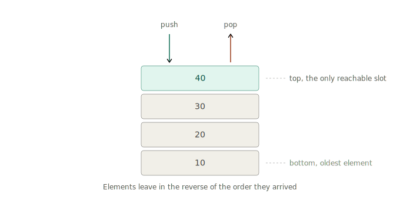
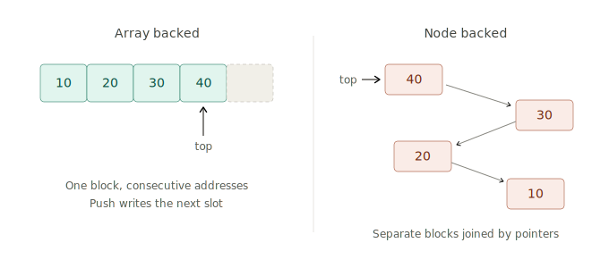
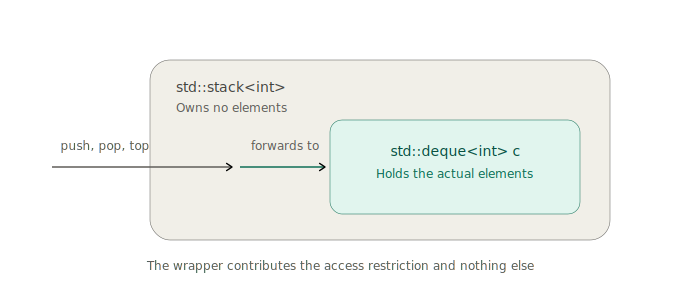
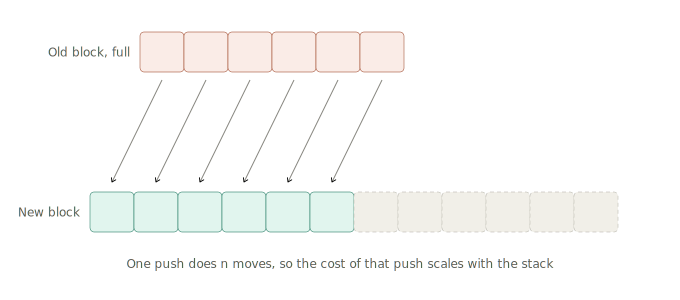
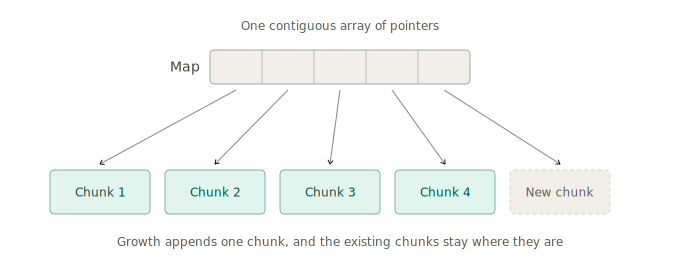

_Most explanations of the stack begin with a picture of plates and a list of three method names. You come away able to use one and completely unable to say why it exists. This note takes the long road instead: we start with the plainest possible question, build the thing from memory upward, and finish knowing why every design decision inside `std::stack` looks the way it does._

Assume you know that a computer stores values in memory, and that memory has addresses. Everything else gets built here.

## Table of contents

## 1. A rule about order

Start with a container that holds values. Ask what makes any particular container what it is.

For an array, the answer lives in memory. An array **is** a run of values at consecutive addresses. Change that arrangement and you have changed the container into something else. The same goes for a red-black tree or a hash table: describe the layout and you have described the thing.

A stack is defined at a different level. Ask where a stack lives in memory and the honest answer is that it lives anywhere you like. A block of memory works. Scattered blocks joined by pointers work. A file on disk works. All of them are stacks, provided they obey one rule:

> Elements come out in the reverse of the order they went in. The only element you may reach is the one added most recently.

That rule has a name, **LIFO**, for last in, first out. It is the entire definition.



Notice where both arrows in that picture touch the structure. Adding happens at the top. Removing happens at the top. The four elements underneath sit there, reachable only after everything above them has left.

So a stack is defined by a **restriction on access**. Take any storage you already have, switch off most of its powers, and keep only the two that operate on the newest element. An array will happily hand you element 0, element 7, element 900, each in constant time. A stack built on that same array offers you the last element and nothing else.

Which raises the obvious question, and it is the one worth sitting with before any code: **what do you gain by giving up the ability to reach into the middle?**

Two answers, one small and one large.

The small answer is speed and simplicity. Since the rule sends every operation to the same known place, the end, there is never a decision about _which_ element to act on and never a search to find it. Nothing shifts to make room, because you always write past the last element. Nothing shifts on removal, because you always take the last element. Every operation is O(1), and the constant is tiny.

The large answer takes a section of its own.

---

## 2. The shape of the world

Look at a line of nested brackets:

```
( [ { } ] )
```

Which bracket has to close first? The `{`, because it opened last. That ordering comes from the structure of nesting itself. Rearrange it into `( [ ) ]` and the string stops meaning anything, because a pair that opens inside another pair has to close inside it too.

This shape shows up everywhere once you start looking for it.

**Function calls.** `main` calls `parse`, `parse` calls `tokenize`. The one that has to finish first is `tokenize`, the one that started last. Every CPU on your desk maintains a region of memory called the call stack for exactly this reason, and it is a literal stack: each call pushes a frame holding local variables and a return address, each return pops one.

**Undo history.** Ctrl+Z reverses your most recent action. Press it again and it reverses the one before that. Editing history unwinds in reverse.

**Nested markup.** An HTML `<div>` opened inside a `<section>` closes before the `<section>` does. Same rule, different syntax.

**Backtracking.** Walking a maze, you take a turn, then another, then hit a dead end. The step you undo first is the last one you took, because that is the only one you can undo without erasing progress you might still need.

In every one of these, reaching into the middle would be a **bug**. Returning from `parse` while `tokenize` is still running would corrupt the program. Undoing your third-from-last edit while keeping the two after it would produce a document that never existed.

So the picture flips. The array's ability to reach any index looked like extra power, and in these problems it is extra power aimed at moves the problem forbids. A stack matches the shape of the problem, and because it matches, the illegal moves become impossible to express. Errors that would have been caught in code review become errors the compiler catches.

That is the real reason stacks exist. Fit.

---

## 3. Working an example: matching brackets

Take the smallest complete problem in this family. Given a string of brackets, decide whether it is properly nested.

Feed the characters through one at a time, keeping a stack:

- **An opening bracket arrives.** Push it. You have taken on an obligation: something must eventually close this.
- **A closing bracket arrives.** Pop, and check that the popped opener is the partner of this closer. That discharges one obligation.

The interesting part is the failure cases, and there are exactly three.

| What happens                              | What it means                            | Example |
| ----------------------------------------- | ---------------------------------------- | ------- |
| A closer arrives while the stack is empty | Closed something that was never opened   | `) (`   |
| The popped opener mismatches the closer   | Crossed nesting                          | `( ]`   |
| Input ends with the stack non-empty       | Opened something that was never closed   | `( (`   |

The second case is the one people skip. Popping alone tells you _something_ was open, and the pair still has to match, so a pop always comes with a comparison.

Here is the version worth memorising, because it generalises far past brackets. The stack holds **unfinished obligations**. Each push records a promise. Each successful match keeps one. A valid string is one where every promise was kept and none was invented out of thin air. Read that sentence again with function calls in mind and you have described the call stack.

```cpp
bool isValid(const std::string& s) {
    std::stack<char> st;
    for (char c : s) {
        if (c == '(' || c == '[' || c == '{') {
            st.push(c);
        } else {
            if (st.empty()) return false;
            char open = st.top();
            st.pop();
            if (c == ')' && open != '(') return false;
            if (c == ']' && open != '[') return false;
            if (c == '}' && open != '{') return false;
        }
    }
    return st.empty();
}
```

One pass, O(n) time, O(n) space in the worst case of an all-opening string. At no point did the algorithm ask for the third element from the bottom. The stack was sufficient because the problem was LIFO shaped, which is the claim from the previous section, now demonstrated.

---

## 4. Building one, take one: a block of memory

Time to build the thing. Take a single contiguous block of memory, wide enough for some number of elements, and keep one integer recording how many slots are filled.

```
[10][20][30][40][  ][  ][  ]
              ^
            size = 4
```

**Push** writes into slot `size` and increments. **Pop** decrements. **Top** reads slot `size - 1`.

All three touch one slot and adjust one integer, so all three are O(1), and the constant is about as small as a constant gets. In C++ this is exactly `std::vector` with `push_back`, `pop_back`, and `back`.

Two properties fall out of contiguity.

Addresses run in order, so the CPU's prefetcher can predict what you will touch next. Modern processors pull memory in **cache lines** of 64 bytes at a time. Reading one `int` from a contiguous block brings the next fifteen along for free. A run of pushes and pops therefore spends most of its time in cache, where access costs a few cycles, and rarely goes out to main memory, where access costs a few hundred.

The second property is the interesting one, and it becomes a whole section later: the block has a fixed size, and something has to happen when it fills up.

---

## 5. Building one, take two: scattered nodes

The other construction gives every element its own small allocation.

A **node** holds two things: the value, and the address of the node beneath it. Keep one pointer, call it `head`, aimed at the topmost node.

```cpp
struct Node {
    int value;
    Node* below;
};

Node* head = nullptr;
```

**Push** allocates a node, points its `below` at the current `head`, and moves `head` to the new node. **Pop** reads `head`, moves `head` to `head->below`, and frees the old node.



Both operations touch a fixed number of pointers regardless of how many elements exist, so this is O(1) as well. Both constructions are correct stacks. Both have the same complexity on paper.

They behave very differently on real hardware.

---

## 6. Choosing between them

Three forces separate them, in order of how much they matter.

### Allocation cost

The node version calls the allocator on every single push and returns memory to it on every single pop. An allocation is real work: it involves searching free lists, updating bookkeeping structures, and often taking a lock in multithreaded programs. Doing that per element puts a heavy constant behind the O(1).

The block version allocates rarely. It grabs a large block, fills it over many pushes, and only touches the allocator when the block runs out. Spread across all the pushes, the allocation cost per element becomes negligible.

### Cache behaviour

This one dominates in practice. Contiguous elements share cache lines, so walking through them keeps the CPU fed from fast memory. Scattered nodes land wherever the allocator had room, which after a program has been running for a while means all over the heap. Following `head->below` requires the value at that address, and if it is cold, the CPU stalls for hundreds of cycles waiting for main memory. Every pop risks that stall.

The gap here is often 5x to 10x in wall clock time, for code that looks identical in complexity analysis.

### Memory overhead

Storing a 4 byte `int` in a node costs 4 bytes for the value plus 8 bytes for the pointer, and alignment usually rounds that to 16. The block version stores 4. A million integers occupy 4 MB one way and 16 MB the other, which affects how much of your data fits in cache in the first place, compounding the previous point.

### Where nodes still win

Two situations favour the node design.

The first is **latency predictability**. The block version has one slow moment, described in section 10, where a single push does a large amount of work. If your program has a hard deadline on every individual operation, such as a trading system that must respond within a fixed number of microseconds, that occasional spike is the thing you care most about avoiding.

The second is **persistence**. Since nodes never move, an old pointer into the structure stays valid forever. That lets you keep several versions of a stack alive at once, each sharing the nodes they have in common, which is how functional languages implement immutable data structures.

For everything else, the block wins, and the standard library is built accordingly.

---

## 7. What std::stack actually is

Here is the design decision that makes the C++ version click.

`std::stack` holds no elements. It has no memory layout of its own and implements no algorithm. It is a **container adapter**: a thin wrapper around a real container, exposing a narrow interface and hiding everything else.

The whole class is roughly this:

```cpp
template<class T, class Container = std::deque<T>>
class stack {
protected:
    Container c;
public:
    void push(const T& v) { c.push_back(v); }
    void pop()            { c.pop_back(); }
    T& top()              { return c.back(); }
    bool empty() const    { return c.empty(); }
    size_t size() const   { return c.size(); }
};
```

Every operation hands the work to the container underneath.



So what does the wrapper contribute? One thing: the **restriction**. The container inside offers `operator[]`, `begin()`, `insert()`, `erase()`, and dozens more. The wrapper exposes five. Writing `s[3]` on a `std::stack` fails to compile, which means the LIFO discipline stops being a convention that the team agrees to follow and becomes a property the type system enforces.

That compile error is the entire product. Everything else was already available.

You can choose the container yourself:

```cpp
std::stack<int> a;                            // std::deque underneath
std::stack<int, std::vector<int>> b;          // std::vector underneath
std::stack<int, std::list<int>> c;            // std::list underneath
```

The adapter needs only three operations from whatever you give it: `back()`, `push_back()`, and `pop_back()`. Any container providing those qualifies. The default is `std::deque`, and section 11 explains why.

---

## 8. Why top and pop are two separate calls

Look again at the signature of `pop`:

```cpp
void pop() { c.pop_back(); }
```

It returns nothing. Reading the top element and removing it are two separate calls:

```cpp
int x = s.top();   // read
s.pop();           // remove
```

Most languages give you a single `pop()` that removes and returns in one step. C++ splits it deliberately, and the reason is **exception safety**.

Imagine the combined design, `T pop()`. To hand the value back to the caller, it has to copy the element into the caller's variable, and copying an arbitrary type can throw. A `std::vector<std::string>` copy allocates, and allocation can fail. So consider the ordering:

1. Remove the top element from the container.
2. Copy it into the caller's variable.

If step 2 throws, the element is already gone from the container and the copy never arrived. The value has been destroyed with no way to recover it and no way to retry, because there is nothing left to retry from.

Reverse the order and the hole is still there. Copy first, then remove, and an exception thrown during the return leaves you in the same position. There is no ordering of a combined remove-and-return that is safe for every type.

The split closes the hole:

- `top()` reads. If the copy throws, the stack is untouched and the caller can try again.
- `pop()` modifies. It returns nothing, so no copy happens on the way out and nothing can throw during the return.

Each call does one thing, so neither can be interrupted halfway through a two-step job.

This principle recurs throughout the standard library. Any operation that both mutates state and returns a value by copy has this exposure, and the library consistently splits such operations in two.

One practical consequence follows. Calling `top()` or `pop()` on an empty stack is **undefined behaviour**, with no exception thrown and no bounds check performed. Adding a check would cost every correct call, so the library leaves it to you:

```cpp
if (!s.empty()) {
    process(s.top());
    s.pop();
}
```

---

## 9. The reference that outlives its element

`top()` returns `T&`, a reference. It gives you direct access to storage the container owns.

That makes the following code dangerous:

```cpp
int& r = s.top();   // r refers to the container's last slot
s.pop();            // the element in that slot is destroyed
std::cout << r;     // undefined behaviour
```

`r` is a **dangling reference**, pointing at storage whose contents have been destroyed. For a plain `int`, destruction leaves the bytes alone, so this often prints the right number during testing and produces garbage months later once something reuses the slot. Silent-correct is the hardest class of bug to find.

A second version of the same problem is easier to miss:

```cpp
int& r = s.top();
s.push(42);         // the container may reallocate and move everything
std::cout << r;     // r refers to the freed old block
```

Both cases obey one law: **a reference into a container stays valid only until the container changes shape.** Anyone who has been bitten by iterator invalidation after an `unordered_map` rehash has met this law already, wearing different clothes.

The habit that avoids it is to copy the value out before mutating:

```cpp
int x = s.top();   // independent copy
s.pop();
```

Reach for the reference form when you are modifying the top element in place, such as `s.top() += 1`, and touching nothing else in between.

---

## 10. The growth problem

Back to the block of memory from section 4, and the question left hanging there.

A contiguous block occupies a fixed span of addresses. The memory immediately after it belongs to something else, so extending it in place is unavailable. When the block fills and another push arrives, the sequence is:

1. Allocate a larger block somewhere else, usually twice the size.
2. Move every existing element into it.
3. Free the old block.



The cost is spread thin by the doubling. Each element gets moved only occasionally, and the total moving work across n pushes stays proportional to n, which gives **amortised O(1)** per push. That is a good average.

The average hides something, though. For a stack holding a million elements, one particular push does a million moves. Almost every push takes nanoseconds, and one takes milliseconds. If you are computing throughput over a long run, the average is what matters and the design is excellent. If you have a deadline on each individual operation, that one push is a problem you have to solve.

Solving it means finding a design where growth costs the same no matter how much data is already stored.

The node design from section 5 achieves that: it never moves anything, since each element sits in its own allocation and stays there. The price was per element allocation, per element pointer overhead, and per pop cache misses, which is a permanent tax in exchange for removing a rare spike.

There is a design in between.

---

## 11. Deque: growing in chunks

`std::deque`, pronounced "deck", short for double-ended queue, splits the difference. (The name refers to its ability to grow at both ends, which matters for other uses. Here it serves purely as storage.)

The idea: surrender contiguity at the level of whole **chunks**, while keeping it inside each chunk.

Allocate a **chunk**, a small contiguous array holding perhaps 512 bytes worth of elements, and fill it. When it fills, allocate another chunk. To keep track of where the chunks are, maintain a separate contiguous array holding one pointer per chunk. That array is called the **map**.



Two levels, and the behaviour that follows:

**An ordinary push** writes into the next free slot of the current chunk. Inside a chunk, memory is contiguous, so this is the same work a vector does.

**A push that fills the chunk** allocates one new chunk and appends its pointer to the map. The existing chunks stay exactly where they are, since they are independent allocations with no requirement to sit next to each other.

That second line is the whole point. Growth costs one small allocation. A deque holding ten elements and a deque holding ten million pay the same price to grow, because the amount of stored data has no bearing on the work involved.

The costs land in two places.

**Indirection.** Reaching element `i` takes two hops: compute which chunk holds it (`i / chunk_size`), read that chunk's pointer from the map, then index within the chunk (`i % chunk_size`). A vector arrives in one address calculation.

**Chunk boundaries.** Iterating stays cache friendly within a chunk and jumps to unrelated memory at each boundary. With 128 elements per chunk, that is one jump every 128 elements.

Now look at which of those a stack actually pays. Indirection is a tax on random access, and a stack performs no random access, because the interface forbids it. So a stack gets the bounded worst case nearly for free, which is exactly why the library made `deque` the default.

One honest footnote: the map itself is a contiguous array, so it can fill and reallocate too. It holds one pointer per hundred or so elements, so it grows roughly a hundred times more slowly, and the thing it copies when it grows is a run of pointers. The spike shrinks by a large factor, which in practice is enough.

Summarising the three storage choices by feel:

- **vector**: fast every time, with occasional very slow moments
- **deque**: slightly slower every time, with a bounded worst case
- **list**: slower every time, with old pointers that stay valid forever

---

## 12. The whole picture in one table

| Operation | Complexity     | What actually happens                            |
| --------- | -------------- | ------------------------------------------------ |
| `push(v)` | O(1) amortised | Write the next free slot, occasionally allocate  |
| `pop()`   | O(1)           | Decrement the size counter, destroy the element  |
| `top()`   | O(1)           | Return a reference to the last slot              |
| `empty()` | O(1)           | Compare the size counter to zero                 |
| `size()`  | O(1)           | Read the size counter                            |

And the choices, gathered in one place:

| Question                                   | Answer          | Because                                       |
| ------------------------------------------ | --------------- | --------------------------------------------- |
| What defines a stack?                      | The LIFO access rule | The layout underneath is free to vary    |
| Why accept the restriction?                | Some problems are LIFO shaped | Illegal moves become unexpressible |
| Which backing by default?                  | `std::deque`    | Growth costs the same at any size             |
| Which backing for raw speed?               | `std::vector`   | Contiguity, best cache behaviour              |
| Why does `pop` return `void`?              | Exception safety | A combined remove-and-return can lose the value |
| Why is `top()` a reference?                | Avoids a copy   | The reference dies when the container changes shape |
| Why does `top()` on empty go unchecked?    | Speed           | Checking would cost every correct call        |

---

## 13. Where this goes next

Everything above concerns the stack as **bookkeeping**: a place to record obligations while walking through input. Brackets, call frames, undo entries. In all of them, the stack tracks state that some other process generated.

The stack has a second life as an **algorithmic device**, where pushing and popping become the computation itself. That is the monotonic stack, the technique behind the "next greater element" family of problems, and it comes from a specific observation: when you scan a sequence comparing pairs, most of the comparisons you would make in a naive O(n²) loop are provably useless, and a stack is the structure that discards them.

Open questions to sit with before that session:

1. For each element of `[2, 1, 5, 6, 2, 3]`, find the first element to its right that is larger. The obvious solution scans forward from each position, giving O(n²). Which of those comparisons carry no information?
2. If element `a` sits to the left of element `b` and `a < b`, can `a` ever be the answer for anything positioned to the right of `b`?
3. What invariant would you have to maintain on a stack of pending elements for question 2 to let you throw things away permanently?
4. The call stack grows downward in memory on most systems and has a fixed size limit. What does infinite recursion do to it, and why is the resulting crash named after a stack?
